# Análise exploratória e criação de modelo de Machine Learning para mercado imobiliário

- [Análise exploratória e criação de modelo de Machine Learning para mercado imobiliário](#análise-exploratória-e-criação-de-modelo-de-machine-learning-para-mercado-imobiliário)
  - [0.0 Importando as bibliotecas](#00-importando-as-bibliotecas)
    - [0.1 Definindo algumas funções do código](#01-definindo-algumas-funções-do-código)
  - [1. Lendo e ajustando as bases](#1-lendo-e-ajustando-as-bases)
    - [1.1 Pré tratamento das bases](#11-pré-tratamento-das-bases)
      - [1.1.1 - Remoção de colunas desinteressantes para o trabalho](#111---remoção-de-colunas-desinteressantes-para-o-trabalho)
      - [1.1.2 - Preenchimento de nulos](#112---preenchimento-de-nulos)
    - [1.2 Junção das bases e criação de novas features](#12-junção-das-bases-e-criação-de-novas-features)
      - [1.2.1 - Juntando a base do censo à base principal](#121---juntando-a-base-do-censo-à-base-principal)
      - [1.2.2 - Criando novas features e modificando algumas variáveis categóricas](#122---criando-novas-features-e-modificando-algumas-variáveis-categóricas)
  - [2. Definição das variáveis e análises visuais](#2-definição-das-variáveis-e-análises-visuais)
    - [2.1 Distribuição das variáveis categóricas](#21-distribuição-das-variáveis-categóricas)
    - [2.2 Distribuição das variáveis numéricas](#22-distribuição-das-variáveis-numéricas)
    - [2.3 Distribuição das variáveis logarítimicas](#23-distribuição-das-variáveis-logarítimicas)
  - [3. Análises Bivariadas](#3-análises-bivariadas)
    - [3.1 - Quantificando os lançamentos imobiliários por região de São Paulo](#31---quantificando-os-lançamentos-imobiliários-por-região-de-são-paulo)
    - [3.2 Analisando os empreendimentos no tempo](#32-analisando-os-empreendimentos-no-tempo)
    - [3.3 Correlações com características do entorno](#33-correlações-com-características-do-entorno)

Esse código é parte do trabalho final desenvolvido para o curso de Data Science e Machine Learning da Tera. A ideia é utilizar a base de lançamentos imobiliários para realizar a exploração e manipulação dos dados, bem como criar um modelo de Machine Learning. A base principal de dados utilizada nesse trabalho é o relatório de lançamentos imobiliários da Empresa Brasileira de Estudos de Patrimônio (EMBRAESP), contendo dados dos lançamentos imobiliários residenciais na Região Metropolitana de Sâo Paulo entre 1985-2013, a base foi disponibilizada pelo Centro de Estudos da Metrópole (CEM)


## 0.0 Importando as bibliotecas
Todo o trabalho de manipulação de bases é realizado principalmente através da biblioteca Pandas, sendo necessária a biblioteca Numpy em algumas ocasiões. Além dessas bibliotecas foram importadas bibliotecas para visualização dos dados


```python
#Evitando alguns avisos de erros que atrapalham a leitura do código
import warnings
warnings.filterwarnings("ignore")


#Manipulação de dados
import pandas as pd
import numpy as np

#Visualização de dados
import seaborn as sns
%matplotlib inline
import matplotlib.pyplot as plt
from plotly.subplots import make_subplots
```


```python
#plt.setp(axa.xaxis.get_majorticklabels(), rotation=45)
```

### 0.1 Definindo algumas funções do código
Essas são algumas funções que são definidas anteriormente porque são utilizadas recorrentemente no código ou são fruto de trabalhos anteriores


```python

#Dado uma lista de colunas e um dataframe, a função plota os histogramas de cada uma das variáveis listadas
def plot_hist_variaveis(conjunto, dataframe, i=0):
    total_plots = len(conjunto)
    fig = plt.figure(figsize=(15,90), facecolor='white')
    fig.subplots_adjust(hspace=0.6, wspace=0.3)

    for var in conjunto:
        ax = fig.add_subplot(total_plots, 2, i+1)

        sns.distplot(x=dataframe[var], ax=ax, color='#435058')
        ax.axvline(x=dataframe[var].mean(), linestyle='--', color='red')
        ax.axvline(x=dataframe[var].median(), linestyle='--', color='green')
        ax.set_title(var + '. Média = {:.2f}, Mediana = {:.2f}'.format(dataframe[var].mean(), dataframe[var].median()))#. # ]format(round(dataframe[var].mean(), 2)))
        ax.set_ylabel('')
        ax.set_xlabel('')
        fig.tight_layout(pad=2)
        i += 1

#Dado uma lista de colunas e um dataframe, a função plota os boxplots de cada uma das variáveis listadas
def plot_bp_variaveis(conjunto, dataframe,resposta, i=0):
    total_plots = len(conjunto)
    fig = plt.figure(figsize=(30,90), facecolor='white')
    fig.subplots_adjust(hspace=0.2, wspace=0.3)

    for var in conjunto:
        ax = fig.add_subplot(total_plots, 2, i+1)

        sns.boxplot(x=dataframe[var], ax=ax, y=dataframe[resposta], color='#A6ECE0')
        ax.set_title(var)
        ax.set_ylabel('')
        ax.set_xlabel('')
        ax.set_ylim(0,np.percentile(dataframe[resposta], 98)) #O limite do percentil no eixo Y é para melhoria da visualização
        plt.xticks(rotation=90)
        fig.tight_layout(pad=2)
        i += 1

#Essa função verifica o tipo das variáveis no dataframe e reduz o tamanho delas. É feita para melhorar a performance do código, uma vez que a base é extensa.
def otimiza_dataframe (dataframe):
    counter_num = 0
    counter_cat = 0
    for col in dataframe.columns:
      if dataframe[col].dtype == 'int64':
          if dataframe[col].max() < 2**7 and dataframe[col].min() > -(2**7):
            dataframe[col] = dataframe[col].astype(np.int8) 
            counter_num += 1 
          elif dataframe[col].max() < 2**15 and dataframe[col].min() > -(2**15):
            dataframe[col] = dataframe[col].astype(np.int16)  
            counter_num += 1 
          elif dataframe[col].max() < 2**31 and dataframe[col].min() > -(2**31):
            dataframe[col] = dataframe[col].astype(np.int32)  
            counter_num += 1 
          elif dataframe[col].max() < 2**63 and dataframe[col].min() > -(2**63):
            dataframe[col] = dataframe[col].astype(np.int64) 
            counter_num += 1    

      elif dataframe[col].dtype == 'float64': 
          if dataframe[col].max() < 2**31 and dataframe[col].min() > -(2**31):
            dataframe[col] = dataframe[col].astype(np.float32)
            counter_num += 1 

      elif dataframe[col].dtype == 'object':
        dataframe[col] = dataframe[col].astype('category')
        counter_cat += 1
    print('Foram otimizadas {} variáveis numéricas e  {} variáveis categóricas'.format(counter_num, counter_cat))


    
```

## 1. Lendo e ajustando as bases
A base da EMBRAESP contém, sozinha, uma série de informações úteis sobre o mercado imobiliário residencial na cidade mas, em um primeiro momento, pensou-se que pode proveitosa a conexão com algumas bases do Censo Demográfico de 2010, a fim de elaborar uma compreensão mais apurada sobre o quadro temático de onde os edifícios lançados se encontram. Todas as bases do Censo foram obtidas diretamente do diretório do Base de Dados


```python
path = "LANRES_85_13_RMSP_CEM.csv"

#Obtendo o dataframe do Censo Demográfico (Básico) a partir da Base dos Dados
df_censo = pd.read_csv('CENSO_2010_TRABALHADO.csv')

#Lendo os dados da EMBRAESP
df = pd.read_csv(path, delimiter=';', decimal=',')
```

### 1.1 Pré tratamento das bases
Alguns pré-tratamentos das duas bases, envolvendo a modificação de tipos das colunas (para facilitar a intersecção posterior entre elas) e a remoção de colunas que não são consideradas úteis para a análise, além do preenchimento de valores nulos

#### 1.1.1 - Remoção de colunas desinteressantes para o trabalho


```python
#Compatibilizando os tipos da coluna que vai servir de join entre os dataframes e renomeando algumas variáveis para facilitar a interpretação
df_censo['id_setor_censitario'] = df_censo['id_setor_censitario'].astype('int64')

#Removendo colunas categóricas com dados muito fragmentados e que não oferecem boa leitura pela alto grau de cardinalidade 
df = df.drop(['NOME_EMP','CEP','SETOR', 'QUADRA', 'LOTE', 'COD_EMP', 'ENDERECOCO', 'LOGRADOURO', 'NUM','CEP_4DIG', 'ENGENHEIRO', 'ARQUITETO', 'HOTELARIA', 'INCOPORADO', 'TIT_VIA', 'PCMEDAU91', 'PCMEDAU00', 'PCMEDAU10'], axis=1)
df.info()

#Removendo colunas de incorporadora, vendedoras e construtoras secundárias no processo dos edifícios. Na maior parte das linhas só há dados 
# para os agentes primários e os agentes secundários tem muitos nulos
remover = []
for col in df.columns:
    for nome in ['INCORPOR_', 'VENDEDOR', 'CONSTRUT_']:
        remover.append(col) if nome in col and col != ('INCORPOR_A' or 'CONSTRUT_A') else None

#por algum motivo uma variável a mais entrou na lista de remoção, como não consegui encontrar a brecha no código removi a coluna da lista manualmente
remover.remove('CONSTRUT_A')
df = df.drop(remover, axis=1)
```

    <class 'pandas.core.frame.DataFrame'>
    RangeIndex: 16935 entries, 0 to 16934
    Data columns (total 67 columns):
     #   Column      Non-Null Count  Dtype  
    ---  ------      --------------  -----  
     0   ID          16935 non-null  int64  
     1   TIPO_EMP    16935 non-null  object 
     2   MES_LAN     16935 non-null  object 
     3   ANO_LAN     16935 non-null  int64  
     4   DATA_ENT    16935 non-null  object 
     5   DIST        13234 non-null  object 
     6   SUBPREF     13234 non-null  object 
     7   MUNICIPIO   16935 non-null  object 
     8   TIPO_VIA    16929 non-null  object 
     9   ZONA        16935 non-null  object 
     10  DORM_UNID   16935 non-null  int64  
     11  BANH_UNID   16935 non-null  int64  
     12  GAR_UNID    16935 non-null  int64  
     13  ELEV        16935 non-null  int64  
     14  COB         16935 non-null  int64  
     15  BLOCOS      16935 non-null  int64  
     16  UNIDAND     16935 non-null  int64  
     17  ANDARES     16935 non-null  int64  
     18  AR_UT_UNID  16935 non-null  float64
     19  AR_TT_UNID  16935 non-null  float64
     20  AR_TT_TERR  16935 non-null  int64  
     21  TT_UNID     16935 non-null  int64  
     22  DORM_EMP    16935 non-null  int64  
     23  BANH_EMP    16935 non-null  int64  
     24  GAR_EMP     16935 non-null  int64  
     25  AU_EMP      16935 non-null  float64
     26  AT_EMP      16935 non-null  float64
     27  PC_TT_UN    16935 non-null  int64  
     28  PC_M2_AU    16935 non-null  float64
     29  PC_M2_AT    16935 non-null  float64
     30  PC_TT_ATU   16935 non-null  float64
     31  PC_AU_ATU   16935 non-null  float64
     32  PC_AT_ATU   16935 non-null  float64
     33  PC_EMP_ATU  16935 non-null  float64
     34  VLR_US__CO  16935 non-null  int64  
     35  PC_TT_UN_U  16935 non-null  float64
     36  PC_M2_AU_U  16935 non-null  float64
     37  PC_M2_AT_U  16935 non-null  float64
     38  SIST_FINAN  16935 non-null  object 
     39  AGENTE      8877 non-null   object 
     40  INCORPORAD  16935 non-null  object 
     41  VENDEDORA   16935 non-null  object 
     42  CONSTRUTOR  16935 non-null  object 
     43  INCORPOR_A  16935 non-null  object 
     44  INCORPOR_B  206 non-null    object 
     45  INCORPOR_C  42 non-null     object 
     46  INCORPOR_D  4 non-null      object 
     47  INCORPOR_E  1 non-null      object 
     48  VENDEDOR_A  16935 non-null  object 
     49  VENDEDORA2  2023 non-null   object 
     50  VENDEDORA3  385 non-null    object 
     51  VENDEDORA4  65 non-null     object 
     52  VENDEDORA5  2 non-null      object 
     53  VENDEDORA6  1 non-null      object 
     54  CONSTRUT_A  16935 non-null  object 
     55  CONSTRUT_B  343 non-null    object 
     56  CONSTRUT_C  50 non-null     object 
     57  CONSTRUT_D  2 non-null      object 
     58  COOPERATIV  16935 non-null  int64  
     59  HOTEL       16935 non-null  int64  
     60  FLAT        16935 non-null  int64  
     61  EXFLAT      16935 non-null  int64  
     62  AP2010      16935 non-null  int64  
     63  SC_2010     16935 non-null  int64  
     64  RENRESP91   16913 non-null  float64
     65  RENRESP00   16935 non-null  float64
     66  RENRESP10   16935 non-null  float64
    dtypes: float64(16), int64(23), object(28)
    memory usage: 8.7+ MB
    


```python
df.info()
```

    <class 'pandas.core.frame.DataFrame'>
    RangeIndex: 16935 entries, 0 to 16934
    Data columns (total 53 columns):
     #   Column      Non-Null Count  Dtype  
    ---  ------      --------------  -----  
     0   ID          16935 non-null  int64  
     1   TIPO_EMP    16935 non-null  object 
     2   MES_LAN     16935 non-null  object 
     3   ANO_LAN     16935 non-null  int64  
     4   DATA_ENT    16935 non-null  object 
     5   DIST        13234 non-null  object 
     6   SUBPREF     13234 non-null  object 
     7   MUNICIPIO   16935 non-null  object 
     8   TIPO_VIA    16929 non-null  object 
     9   ZONA        16935 non-null  object 
     10  DORM_UNID   16935 non-null  int64  
     11  BANH_UNID   16935 non-null  int64  
     12  GAR_UNID    16935 non-null  int64  
     13  ELEV        16935 non-null  int64  
     14  COB         16935 non-null  int64  
     15  BLOCOS      16935 non-null  int64  
     16  UNIDAND     16935 non-null  int64  
     17  ANDARES     16935 non-null  int64  
     18  AR_UT_UNID  16935 non-null  float64
     19  AR_TT_UNID  16935 non-null  float64
     20  AR_TT_TERR  16935 non-null  int64  
     21  TT_UNID     16935 non-null  int64  
     22  DORM_EMP    16935 non-null  int64  
     23  BANH_EMP    16935 non-null  int64  
     24  GAR_EMP     16935 non-null  int64  
     25  AU_EMP      16935 non-null  float64
     26  AT_EMP      16935 non-null  float64
     27  PC_TT_UN    16935 non-null  int64  
     28  PC_M2_AU    16935 non-null  float64
     29  PC_M2_AT    16935 non-null  float64
     30  PC_TT_ATU   16935 non-null  float64
     31  PC_AU_ATU   16935 non-null  float64
     32  PC_AT_ATU   16935 non-null  float64
     33  PC_EMP_ATU  16935 non-null  float64
     34  VLR_US__CO  16935 non-null  int64  
     35  PC_TT_UN_U  16935 non-null  float64
     36  PC_M2_AU_U  16935 non-null  float64
     37  PC_M2_AT_U  16935 non-null  float64
     38  SIST_FINAN  16935 non-null  object 
     39  AGENTE      8877 non-null   object 
     40  INCORPORAD  16935 non-null  object 
     41  CONSTRUTOR  16935 non-null  object 
     42  INCORPOR_A  16935 non-null  object 
     43  CONSTRUT_A  16935 non-null  object 
     44  COOPERATIV  16935 non-null  int64  
     45  HOTEL       16935 non-null  int64  
     46  FLAT        16935 non-null  int64  
     47  EXFLAT      16935 non-null  int64  
     48  AP2010      16935 non-null  int64  
     49  SC_2010     16935 non-null  int64  
     50  RENRESP91   16913 non-null  float64
     51  RENRESP00   16935 non-null  float64
     52  RENRESP10   16935 non-null  float64
    dtypes: float64(16), int64(23), object(14)
    memory usage: 6.8+ MB
    

#### 1.1.2 - Preenchimento de nulos


```python
#As variáveis de distrito e subprefeitura só fazem menção aos locais dentro da cidade de São Paulo, então coloquei os valores nulos como "Fora de São Paulo", apenas para facilitar a manipulação posterior
df[['DIST', 'SUBPREF']] = df[['DIST', 'SUBPREF']].fillna('FORA-SP')


#Colunas numéricas que na verdade são categóricas
for col in ['COOPERATIV', 'HOTEL', 'FLAT', 'EXFLAT']:
    df[col] = df[col].astype(dtype='category')


```

### 1.2 Junção das bases e criação de novas features
A conexão das bases é realizada a partir do setor censitário, logo, as informações captadas do Censo dizem respeito a todo o setor censitário ao qual o empreendimento está inserido. Um setor censitário pode conter (e normalmente contém) mais de um empreendimento. O Censo do IBGE possui uma infinidade de variáveis e foram selecionadas apenas algumas que dão uma visão geral sobre o setor. Foram criadas variações percentuais das features incorporadas no modelo, uma vez que os números absolutos podem ser muito distintos por setor censitário.
Também foram modificadas as features de incorporadora e construtora, uma vez que apresentavam alta cardinalidade

#### 1.2.1 - Juntando a base do censo à base principal


```python
#Juntando a base da EMBRAESP e a(s) base(s) do Censo a partir dos setores censitários
df = df.join(df_censo.set_index('id_setor_censitario'), on='SC_2010', how='left')

#Os dados das colunas são pesados e a otimização dos dataframes leva em consideração o tamanho dos números em cada coluna para converter a um dtype adequado, visando diminuir o peso.
otimiza_dataframe(df)
```

    Foram otimizadas 51 variáveis numéricas e  14 variáveis categóricas
    

#### 1.2.2 - Criando novas features e modificando algumas variáveis categóricas

.1 - Censo demográfico


```python

#Criando variáveis percentuais a partir das variáveis base do censo
df['PERC_ALUGADOS'] = (df['Domicilios alugados']/df['Domicílios_Setor'])*100
df['PERC_UNIPESSOAIS'] = (df['Domicilios unipessoais']/df['Domicilios no setor censitário'])*100
df['PERC_2_3_MORADORES'] = (df['Domicilios 2 ou 3 moradores']/df['Domicilios no setor censitário'])*100
df['PERC_4_MAIS_MORADORES'] = (df['Domicilios 4 ou mais moradores']/df['Domicilios no setor censitário'])*100
df['PERC_BRANCOS'] = (df['Brancos']/df['Residentes no setor censitário'])*100
df['PERC_PPI'] = ((df['Pretos'] + df['Pardos'] + df['Índigenas'])/df['Residentes no setor censitário'])*100

```

.2 - Incorporadoras e construtoras


```python
#A cardinalidade de incorporadoras e construtoras é muito alta porque existe um mercado grande em São Paulo. Assim, agrupei as duas categorias
#A partir da soma do valor de mercado dos empreendimentos, separando entre as 50 maiores e as restantes. Cada uma das features contava originalmente com cerca
#de 500 entradas diferentes
df_incorporadoras = df.groupby(df['INCORPORAD']).sum()
df_incorporadoras = df_incorporadoras.sort_values('PC_EMP_ATU', ascending=False)
incorporadoras_maiores = df_incorporadoras.iloc[0:51]

df_construtoras = df.groupby(df['CONSTRUTOR']).sum()
df_construtoras = df_construtoras.sort_values('PC_EMP_ATU', ascending=False)
construtoras_maiores = df_construtoras.iloc[0:51]

df['INCORPORAD'] = df['INCORPORAD'].astype('string')
df['CONSTRUTOR'] = df['CONSTRUTOR'].astype('string')

#Cria a lista das maiores e menores incorporadoras
incorporadoras_maiores = incorporadoras_maiores.index.to_list()
construtoras_maiores = construtoras_maiores.index.to_list()

#Verifica, em cada linha, a qual grupo as incorporadoras pertencem
for idx, linha in df.iterrows():
    if linha['INCORPORAD'] in incorporadoras_maiores:
        df.at[idx, 'INCORPORAD'] = 'MAIORES INCORPORADORAS'
    else:
        df.at[idx, 'INCORPORAD'] = 'iNCORPORADORA MENOR'

for idx, linha in df.iterrows():
    if linha['CONSTRUTOR'] in construtoras_maiores:
        df.at[idx, 'CONSTRUTOR'] = 'MAIORES CONSTRUTORAS'
    else:
        df.at[idx, 'CONSTRUTOR'] = 'CONSTRUTORAS MENORES'

```

.3 - Agentes de financiamento


```python
#Existem uma série de agentes que podem ter financiado o empreendimento e a escolha do agente pode influenciar diretamente
#nos preços de produção. Separei os valores entre agente públicos e privados, como uma categorização preliminar, mas distinções
#melhores são possíveis

financiamento = ['SFH', 'CEF', 'SBPE', 'CAIXA', 'BANCO DO BRASIL', 'BB', 'SBPE']

df['AGENTE'] = df['AGENTE'].astype('string')
df['AGENTE'] = df['AGENTE'].fillna('SEM INFORMAÇÃO')

for idx, linha in df.iterrows():
    if linha['AGENTE'] != 'SEM INFORMAÇÃO':
        if linha['AGENTE'].upper() in financiamento:
            df.at[idx, 'AGENTE'] = 'PUBLICO'
        else:
            df.at[idx, 'AGENTE'] = 'PRIVADO'
```

## 2. Definição das variáveis e análises visuais

É definida a variável resposta (que será utilizada posteriormente no modelo de Machine Learning), bem como as variáveis numéricas e categóricas. A definição dessas variáveis ajuda na visualização dos dados e na execução dos pipelines


```python
#A variável resposta é o preço da unidade a partir do valor atualizado de 2013. 
v_resposta = "PC_TT_ATU"

#A divisão entre variáveis int e float é apenas para possíveis questões de performance
v_numericos = df.select_dtypes(include=["int8", "int16", "int32", "int64", "float"]).columns.to_list()
#[v.remove(v_resposta) for v in [v_numericos]]
[v.remove('ID') for v in [v_numericos]]

v_categoricos = ['TIPO_EMP', 'DIST', 'SUBPREF', 'MUNICIPIO', 'TIPO_VIA', 'ZONA', 'SIST_FINAN', 'AGENTE']
```

### 2.1 Distribuição das variáveis categóricas

A distribuição das variáveis categóricas mostra que algumas delas, como a zona, o tipo de via e o sistema financeiro, apresentam grande variação no preço do imóvel. As duas primeiras têm relação direta com a localização do empreendimento, no caso da Zona, a diferenciação do preço do imóvel faz total sentido, uma vez que são concedidos incentivos a alguns tipos de zonas da cidade, enquantos são impostas restrições a outras delas. O alto valor nas zonas exclusivamente residenciais (ZER) pode ter relação, por exemplo, com a localização privilegiada dessas zonas em áreas mais consolidadas da cidade e com a dificuldade de disponbiilidade de terreno para verticalização nas mesmas. Por outro lado, as Zonas Especiais de Interesse Social (ZEIS), por exemplo, tem um valor de unidade muito menor, uma vez que embora tenham incentivos para construção destinam-se a criação de unidades habitacionais para grupos de baixa renda. 
O sistema financeiro impacta largamente o preço final do imóvel uma vez que definem amplamente o preço e o aporte incial do valor do imóvel. Imóveis a preço de custo, por exemplo, requerem alto investimento inicial, uma vez que os empreendedores arcam diretamente com o preço do produto. Por outro lado, imóveis consorciados tendem a ter preço de venda menor, uma vez que os valores da construção são mais diluídos


```python
plot_bp_variaveis(dataframe=df, conjunto=v_categoricos, resposta=v_resposta)
```


    
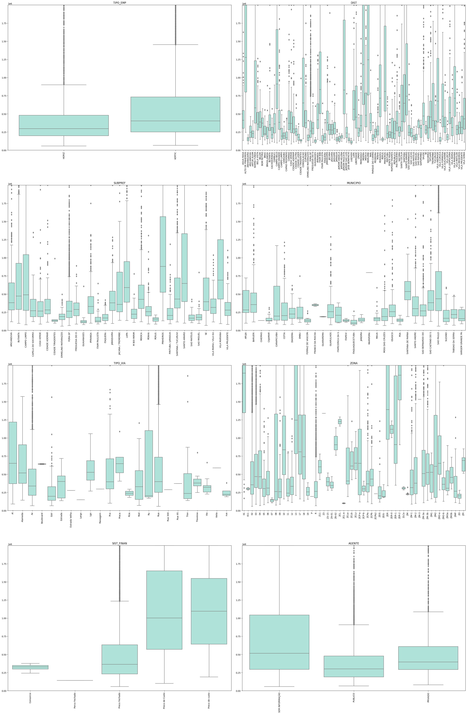
    


### 2.2 Distribuição das variáveis numéricas


```python
for col in df[v_numericos].columns:
    limite = df[col].quantile(0.95)
    df[col] = df[col].where(df[col] < limite, limite)
    
plot_hist_variaveis(v_numericos, df)
```


    
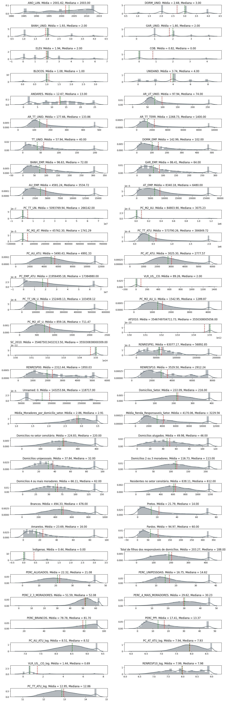
    


```python
#df_zero = df.loc[df['PC_TT_ATU'] == 0]
#df_zero.shape #118 colunas com preço da unidade igual a 0
```


```python
#df['PC_TT_UN'].replace(0,df['PC_TT_UN'].mean(axis=0),inplace=True)
#df['PC_TT_UN'].describe()
```

### 2.3 Distribuição das variáveis logarítimicas
Como o plot das variáveis numéricas apontou que grande parte delas está desbalanceada com calda para direita, são feitas algumas alterações nas variáveis de preço, a fim de normalizar as distribuições. As variáveis dos valores de m² da área útil e total das unidades, bem como do preço da unidade, acabam ficando mais normalizadas


```python
#Cria uma lista com as variáveis que interessam serem passadas para a forma logaritimica, bem como uma segunda lista para receber essas variáveis
v_precos = ['PC_AU_ATU', 'PC_AT_ATU', 'VLR_US__CO', 'RENRESP10', v_resposta]
v_precos_log = []

#Cria as versões logaritimicas de cada variável, adiciona no datarame e na lista
for col in v_precos:
    #df[col] = df[col].where(df[col] == 0, 0.0001)
    df[col+'_log'] = np.log(df[col])
    v_numericos.append(col+'_log')
    v_precos_log.append(col+'_log')

v_resposta_log = 'PC_TT_ATU_log'

#Plota as novas variáveis
plot_hist_variaveis(v_precos_log, df)
```


    
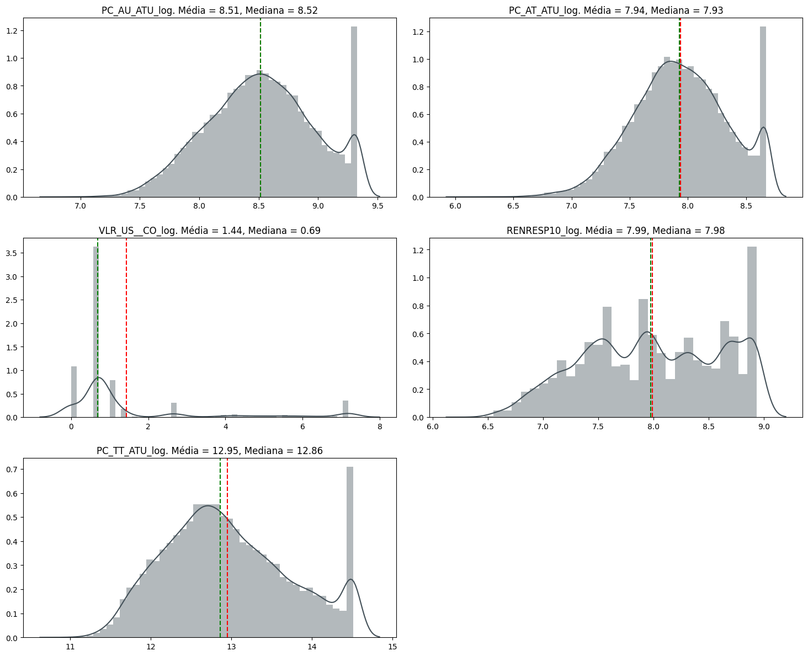
    


## 3. Análises Bivariadas
Com as variáveis numéricas dos preços ajustadas, é interessante verificar os impactos das categorias nos valores do imóvel. A seguir são apresentadas leituras sobre os empreendimentos a partir de sua localização e período de lançamento

### 3.1 - Quantificando os lançamentos imobiliários por região de São Paulo 
Para facilitar a distinção geográfica, as subprefeituras de São Paulo foram agrupadas a partir de cada uma das regiões previstas pela divisão municipal


```python
#Criando uma nova variável "REGIAO" que categoriza cada linha em sua região a partir de seu distrito
regioes = {'Centro': ['SE'],
           'Nordeste': ['CASA VERDE', 'SANTANA / TUCURUVI', 'VILA MARIA / VILA GU', 'JACANA / TREMEMBE'],
           'Noroeste': ['FREGUESIA DO O ', 'PIRITUBA / JARAGUA', 'PERUS'],
           'Oeste': ['BUTANTA', 'PINHEIROS', 'LAPA'],
           'Centro-Sul': ['VILA MARIANA', 'JABAQUARA', 'SANTO AMARO'],
           'Sul': ['CAMPO LIMPO', 'M BOI MIRIM', 'PARELHEIROS', 'CAPELA DO SOCORRO', 'CIDADE ADEMAR'],
           'Sudeste': ['IPIRANGA', 'VILA PRUDENTE', 'ARICANDUVA', 'MOOCA'],
           'Leste 1': ['PENHA', 'ERMELINO MATARAZZO', 'ITAQUERA', 'SAO MATEUS'],
           'Leste 2': ['SAO MIGUEL', 'ITAIM PAULISTA', 'GUAIANASES', 'CIDADE TIRADENTES'],
           'RMSP': ['FORA-SP']
}

regioes = {valor:chave for chave, lista in regioes.items() for valor in lista}
df['REGIAO'] = df['SUBPREF'].map(regioes)

#Dataframes com os filters de cada região, são utilizados para verificar cada região separadamente a seguir
df_sul = df.query('REGIAO == "Sul"')
df_noroeste = df.query('REGIAO == "Noroeste"')
df_nordeste = df.query('REGIAO == "Nordeste"')
df_centrosul = df.query('REGIAO == "Centro-Sul"')
df_sudeste = df.query('REGIAO == "Sudeste"')
df_leste1 = df.query('REGIAO == "Leste 1"')
df_oeste = df.query('REGIAO == "Oeste"')
df_centro = df.query('REGIAO == "Centro"')
df_leste2 = df.query('REGIAO == "Leste 2"')
```

3.1.1 - Verificando o valor dos empreendimentos e do m² em cada região</54>
Há um disparidade entre o número de lançamentos por região em São Paulo. As regiões oeste e centro-sul concentram a grande parte dos empreendimentos, enquanto as zonas leste e norte tiveram um número de lançamentos comparativamente muito menor. Verifica-se que os locais de maior número de lançamentos imobiliários se confundem com os de maiores valores do empreendimento e do m², de maneira semelhante, os empreendimentos lançados nas regiões norte e leste possuem valor de mercado relativamente menor


```python
#Plotando as figuras dos gráficos relacionados ao valor dos empreenidmentos
fig, axs = plt.subplots(figsize=(15,20), ncols=2, nrows=2, facecolor='white')
n_emp_regiao = sns.histplot(x='REGIAO', data=df, ax=axs[0][0], color='#A99F96')
n_unid_emp = sns.boxplot(x='REGIAO', y='TT_UNID', data=df, ax=axs[0][1], palette='Spectral')
pc_emp_regiao = sns.boxplot(x='REGIAO', y='PC_EMP_ATU', data=df, ax=axs[1][0], palette='Spectral')
pc_m2_regiao = sns.boxplot(x='REGIAO', y='PC_AT_ATU', data=df, ax=axs[1][1], palette='Spectral')

n_emp_regiao.set_title('Número de empreendimentos lançados por região')
n_unid_emp.set_title('Número médio de unidades nos empreendimentos por região')
pc_emp_regiao.set_title('Valor médio do empreendimento por região')
pc_m2_regiao.set_title('Valor médio do m² do empreendimento por região')

plt.xticks(rotation=90)
n_emp_regiao.tick_params('x', labelrotation=90)
pc_emp_regiao.tick_params('x', labelrotation=90)
pc_m2_regiao.set_ylim(0,10000)

plt.suptitle('Lançamentos imobiliários residenciais (1985-2013)')
plt.tight_layout(pad=2)
```


    
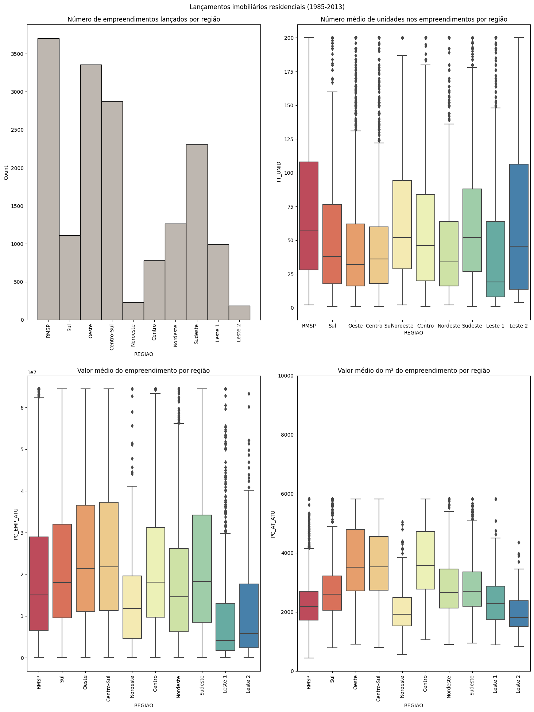
    


```python
fig, axs = plt.subplots(figsize=(15,10), ncols=2, nrows=1, facecolor='white')
m2_dorm = sns.boxplot(x='DORM_UNID', y='PC_TT_ATU', data=df, ax=axs[0], palette='Spectral')
pc_m2_regiao = sns.countplot(x=df['DORM_UNID'], hue='REGIAO', data=df, ax=axs[1], palette='Spectral')

axs[0].set_title('Valor do m² por número de dormitórios')
axs[1].set_title('Número de dormitórios por região')

plt.suptitle('Lançamentos imobiliários residenciais (1985-2013)')
plt.tight_layout()
```


    
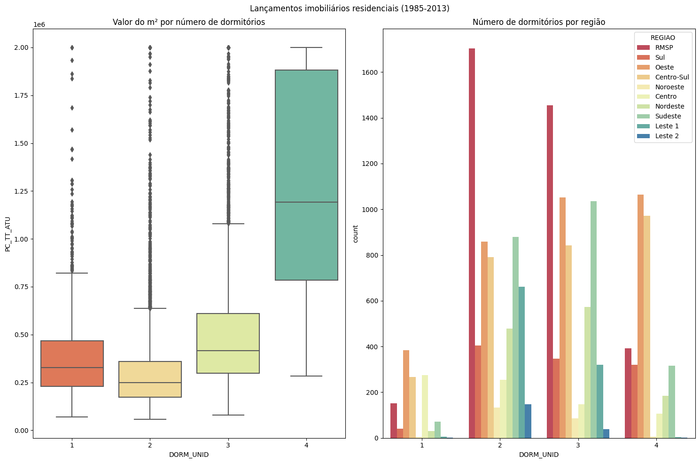
    


```python
#Função que plota 
def m2_dorm_regiao (lista_dataframes):
    for i, dataframe in enumerate(lista_dataframes):
        fig, axs = plt.subplots(figsize=(20,10), ncols=3, nrows=1, facecolor='white')
        area_pc_regiao = sns.scatterplot(x='AR_TT_UNID', y=v_resposta, hue='REGIAO', data=dataframe, ax=axs[0], palette='Greys')
        dorm_unid_pc_box = sns.boxplot(x='DORM_UNID', y=v_resposta, data=dataframe, ax=axs[1], palette='Spectral')
        num_dorm = sns.countplot(x='DORM_UNID', hue='REGIAO', data=dataframe, palette='Greys')

        axs[0].set_title('Área total da unidade pelo valor do m²')
        axs[1].set_title('Valor do m² por número de dormitórios')
        axs[2].set_title('Número de dormitórios por região')

        axs[0].set_ylim(0, 2500000)
        axs[1].set_ylim(0, 2500000)
        axs[2].set_ylim(0, 1500)
        plt.xticks(rotation=90)
        plt.suptitle('Lançamentos imobiliários residenciais (1985-2013) em {}'.format(dataframe['REGIAO'].mode()))
        plt.tight_layout()
```


```python
m2_dorm_regiao([df_sul, df_noroeste, df_nordeste, df_centrosul, df_sudeste, df_leste1, df_oeste, df_centro, df_leste2])
```


    
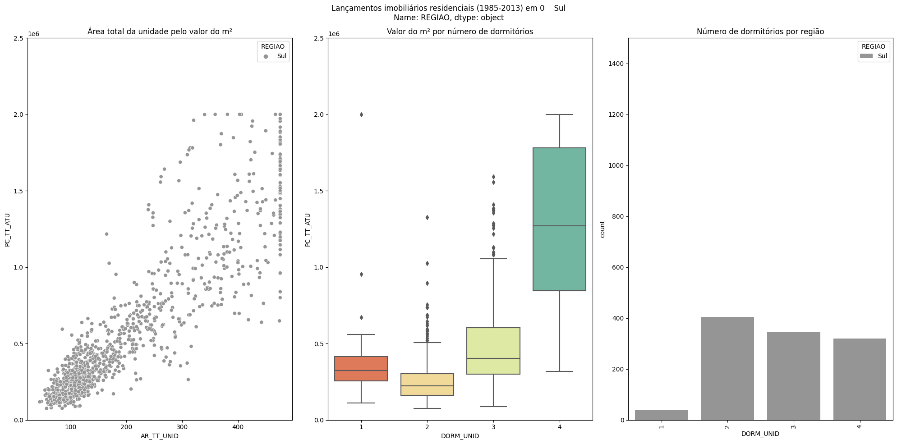
    


    

    


    
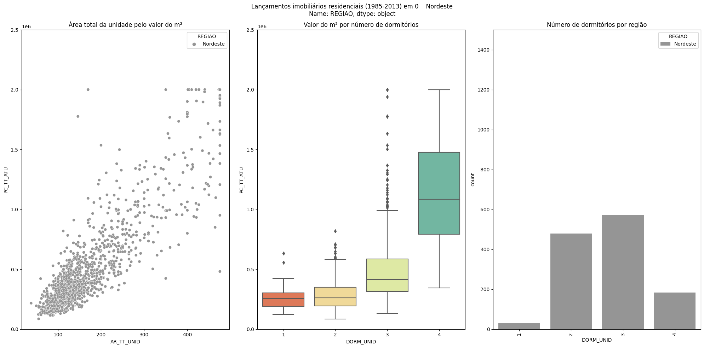
    


    
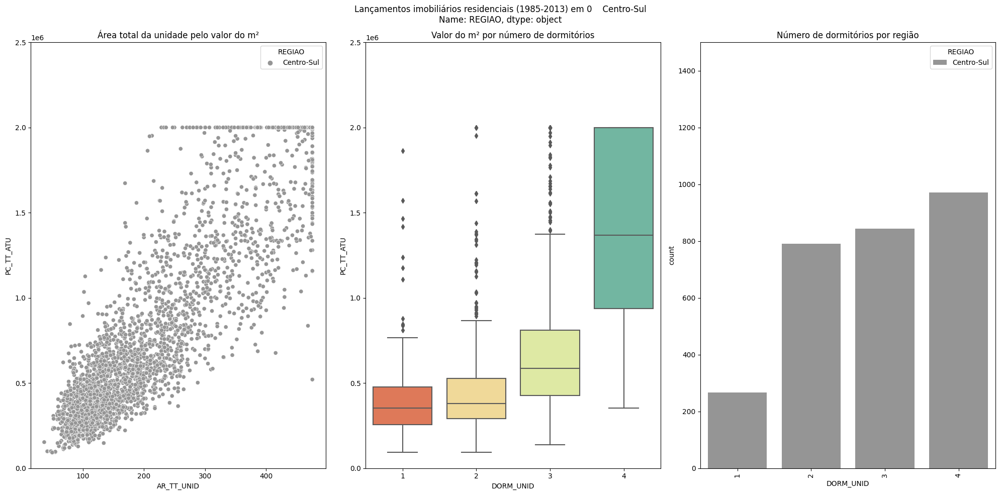
    


    
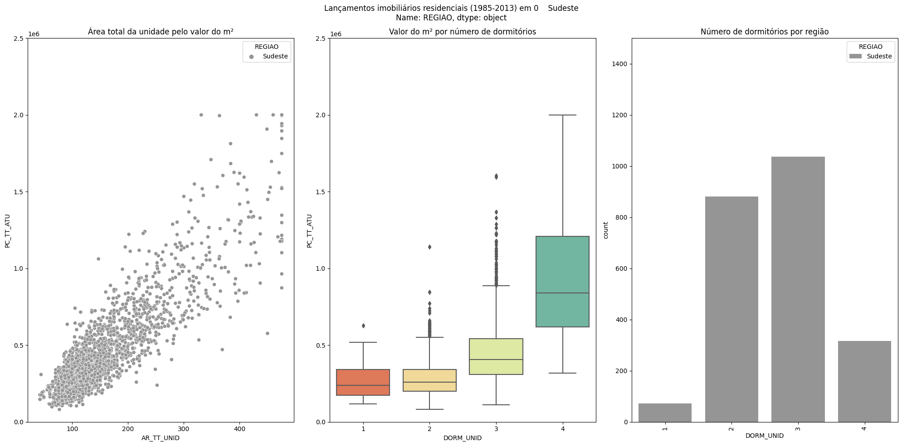
    


    
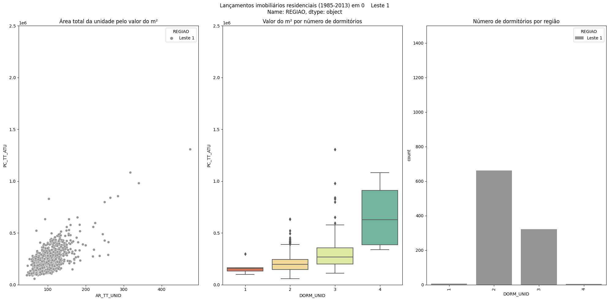
    


    
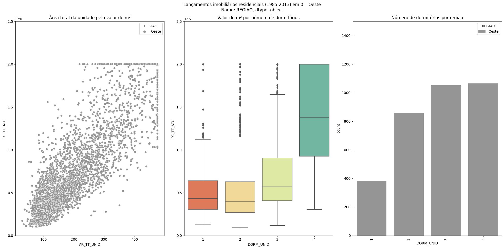
    


    
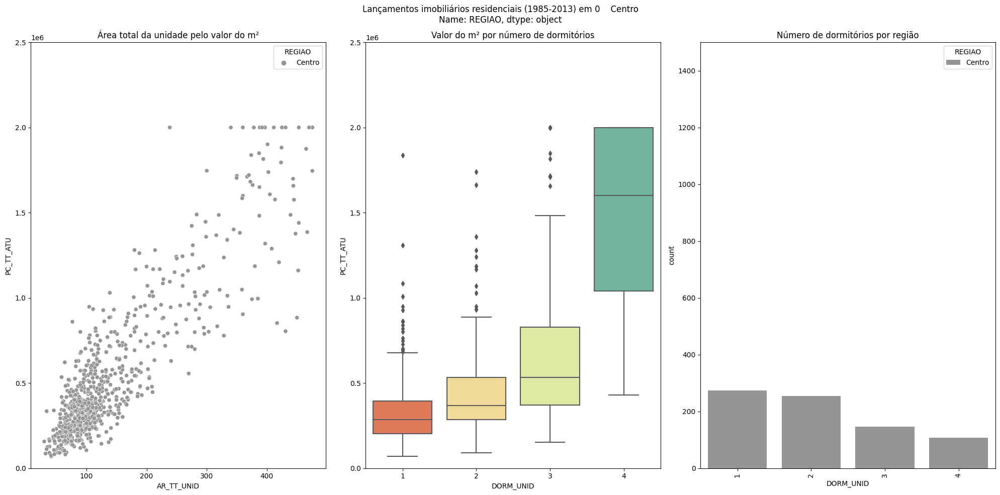
    


    
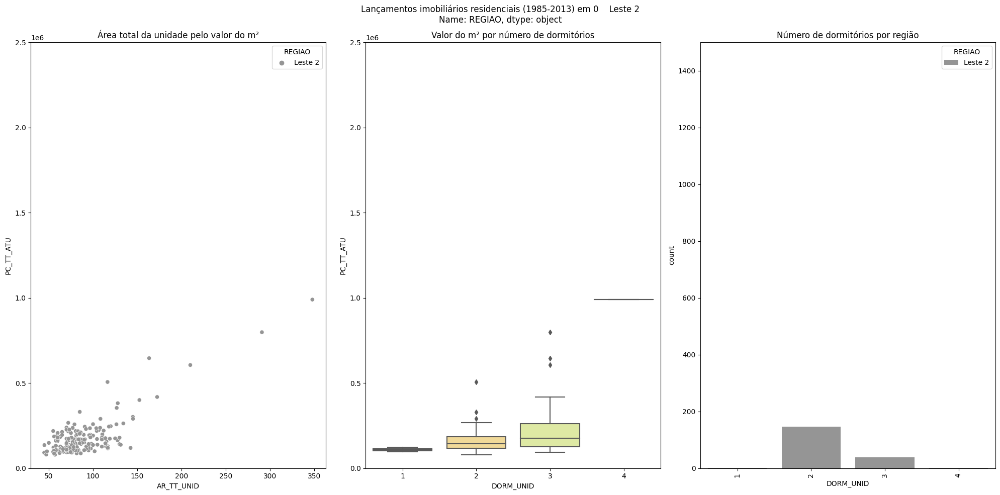
    


A renda do responsável é muito distinta em cada região, as regiões com maiores números de empreendimentos também são as com empreendimentos mais caros e as que concentram as maiores rendas. As regiões com as menores rendas possuem poucos lançamentos imobiliários


```python
fig = plt.subplots(figsize=(15,15))
sns.boxplot(y='RENRESP10', data=df, x='REGIAO', palette='Spectral')
plt.suptitle('Renda média do responsável por região')
plt.tight_layout()
```


    
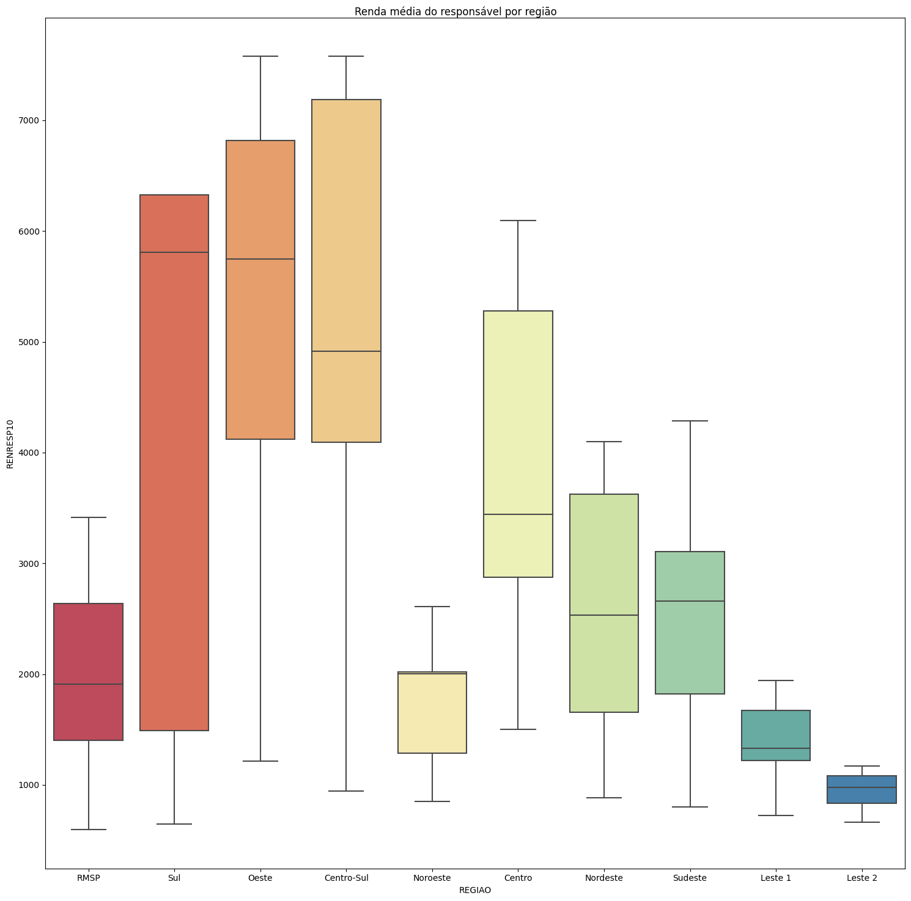
    


### 3.2 Analisando os empreendimentos no tempo
Em um geral, o número de lançamentos imobiliários cresceu entre 1985 e 2013, mas as unidades se tornaram consideravelmente menores e com um número menor de quartos, principalmente a partir de 2008. O preço médio do m² foi o menor registrado ao longo da década de 2000, mas tem retomada de crescimento e tendência de ascensão começando em 2010


```python
fig, axs = plt.subplots(figsize=(20,10), nrows=2, ncols=2)
emp_ano = sns.countplot(data=df.groupby(df['ANO_LAN']).count(), x=df['ANO_LAN'], ax=axs[0,0], color='#DD403A')
pc_m2_ano = sns.barplot(y=df['PC_AU_ATU'], x=df['ANO_LAN'], data=df.groupby(df['ANO_LAN']).mean(), ax=axs[0,1], color='#DD403A')
dorm_ano = sns.barplot(y=df['DORM_UNID'], x=df['ANO_LAN'], data=df.groupby(df['ANO_LAN']).mean(), ax=axs[1,0], color='#DD403A')
area_util_ano = sns.barplot(y=df['AR_UT_UNID'], x=df['ANO_LAN'], data=df.groupby(df['ANO_LAN']).mean(), ax=axs[1,1], color='#DD403A')

emp_ano.tick_params(labelrotation = 90)
pc_m2_ano.tick_params(labelrotation = 90)
dorm_ano.tick_params(labelrotation = 90)
area_util_ano.tick_params(labelrotation = 90)

pc_m2_ano.set_ylim(2000,10000)
dorm_ano.set_ylim(2,3.5)
area_util_ano.set_ylim(60,150)

emp_ano.set_title('Número de empreendimentos lançados por ano')
pc_m2_ano.set_title('Preço médio do m² da área total por ano')
dorm_ano.set_title('Média de dormitórios por unidade nos anos')
area_util_ano.set_title('Média de área útil da unidade por ano')

plt.tight_layout()

```


    

    


### 3.3 Correlações com características do entorno


```python
def plot_relacao_censo(dataframe, variaveis, i=0):
    total_plots = len(variaveis)
    fig = plt.figure(figsize=(15,40), facecolor='white')
    #fig.subplots_adjust(hspace=0.6, wspace=0.3)

    for var in variaveis:
        ax = fig.add_subplot(total_plots, 2, i+1)
        sns.scatterplot(x=var, y=v_resposta, data=dataframe, ax=ax, color='#435058')
        i += 1
        plt.xlim(0, dataframe[var].quantile(0.99))
```


```python
df['PERC_ALUGADOS'].quantile([0.01, 0.99])
```


    0.01     2.631579
    0.99    43.925236
    Name: PERC_ALUGADOS, dtype: float64


```python
#plot_relacao_censo(df, v_censo)
```


    
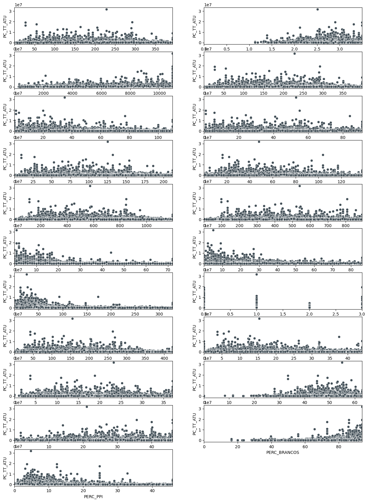
    


```python
#df.to_csv('Base_EMBRAESP_Trabalhada.csv')
```
