# Tera-Mercado-Imobiliario-SP

- [Tera-Mercado-Imobiliario-SP](#tera-mercado-imobiliario-sp)
    - [Notebooks com os códigos utilizados:](#notebooks-com-os-códigos-utilizados)
  - [0. Introdução e problema](#0-introdução-e-problema)
  - [1. Desenho da solução](#1-desenho-da-solução)
  - [2. Base de dados trabalhada](#2-base-de-dados-trabalhada)
  - [3. EDA (Análise Exploratória dos Dados)](#3-eda-análise-exploratória-dos-dados)
  - [4. Machine Learning para entendimento e previsão dos preços](#4-machine-learning-para-entendimento-e-previsão-dos-preços)
    - [4.1 Modelo de interpretação do valor do imóvel](#41-modelo-de-interpretação-do-valor-do-imóvel)
    - [4.2 Modelo de predição do valor do imóvel](#42-modelo-de-predição-do-valor-do-imóvel)
  - [5. Conclusão](#5-conclusão)


### Notebooks com os códigos utilizados:
- ### [EDA](Documentação/Codigo_EDA.md)
- ### [Modelo Preditivo](Documentação/modelo_preditivo.md)
  Essas são versões em formato markdown (.md) para melhor visualização na página do portfólio. Os documentos em formato ipynb estão disponíveis no repositório.
 
 ## 0. Introdução e problema

 O mercado imobiliário compreende a venda e locação de milhares de imóveis todos os dias, sob diversas formas de negócio e abrangendo uma quantidade muito diversa de tipologias, além de um público muito variado. Por mais distintas que as pessoas sejam, é seguro afirmar que a grande maioria delas tem de lidar com algum processo de compra, venda, ou aluguel de algum imóvel pelo menos uma vez na vida.

A cidade de São Paulo, junto de sua região metropolitana, é um dos maiores polos de desenvolvimento imobiliário do Brasil: [segundo dados da SECOVI-SP](http://indiceseconomicos.secovi.com.br/indicadormensal.php?idindicador=85), no ano de 2022 foram lançadas 75.692 unidades habitacionais residenciais na cidade de São Paulo, somando um Valor Geral de Vendas (VGV) previsto de mais de 40 bilhões de reais.

Havendo uma gama tão vasta de empreendimentos em uma dinâmica imobiliária acelerada e com um público alvo muito diverso, é intuitivo pensar que a definição do preço de um produto imobiliário (uma casa ou um apartamento, por exemplo) é um dos principais problemas na hora da elaboração e lançamento de um empreendimento. A alta oferta de unidades desfavorece a determinação de valores muito acima dos do mercado, paralelamente, o empreendimento imobiliário requer alto aporte inicial e tem lenta liquidez, o que torna arriscada a venda de unidades em valores muito abaixo dos praticados no mercado.

A precificação é um dos fatores mais fundamentais do empreendimento imobiliário e deve ser realizada ainda nas primeiras fases do projeto, nesse sentido, como é possível definir o preço de venda de uma unidade habitacional de modo que o valor seja competitivo no mercado? Quais variáveis podem ajudar melhor a prever o valor final de uma casa ou apartamento e qual o impacto delas sobre o produto? Esse certamente é um problema complexo, mas o estudo do que foi lançado em São Paulo pode indicar um caminho no entendimento e mesmo na predição dos preços.

## 1. Desenho da solução
A predição do preço da unidade é interessante para o mercado e para o usuário, uma vez que permite estipular as possibilidades de ganhos antes mesmo do início do empreendimento, enquanto permite averiguar a diferença do valor da unidade em relação ao previsto, ajudando na obtenção de melhores negócios. A antecipação dos preços de venda da unidade não é uma tarefa fácil mas, por sorte, o python mantém uma série de ferramentas úteis para o entendimento dos dados e também para a criação de modelos preditivos a partir de algoritmos de Machine Learning.

Esse artigo explora o potencial da ferramenta na resolução de problemas de precificação a partir de duas etapas distintas: primeiro, realiza uma etapa exploratória dos dados (popularmente conhecida como EDA — Exploratory Data Analysis), onde identifica as características da base de dados, encontra padrões de distribuição, verifica dados faltantes e elabora leituras sobre o conjunto. Todo o processo de EDA é realizado, principalmente, através da manipulação de Dataframes que as bibliotecas Pandas e Numpy permitem realizar com praticidade; A segunda parte do texto se dedica à elaboração de modelos preditivos do valor da unidade, realizados a partir do aprendizado supervisionado de uma base já ajustada durante a EDA e com o apoio de algoritmos de regressão das bibliotecas de Statsmodel e ScikitLearn do python.

## 2. Base de dados trabalhada
Um dos aspectos fundamentais para o aprendizado supervisionado de Machine Learning é uma boa base de dados. Ainda que o algoritmo de previsão esteja totalmente refinado ou parametrizado, as chances de erro na produção são grandes se a máquina aprende a partir de uma base com poucas entradas, com dados incompletos ou que não representa uma amostra real do objeto analisado. Nesse sentido, esse artigo utiliza do conhecimento prévio sobre os lançamentos imobiliários em São Paulo para a determinação do preço do imóvel.

A base de dados principal utilizada no trabalho contém os lançamentos imobiliários residenciais ocorridos na Região Metropolitana de São Paulo entre 1985 e 2013, os dados foram coletados pela [Empresa Brasileira de Estudos do Patrimônio (EMBRAESP)](https://embraesp.com.br/) e disponibilizados pelo Centro de Estudos da Metrópole da FFLCH/USP (CEM/FFLCH-USP), através do [link](https://centrodametropole.fflch.usp.br/pt-br/node/8403). Esses dados estão, a priori, em formato shapefile — comumente utilizado em trabalhos de georreferenciamento — e a base em CSV foi obtida através da modificação do formato no software QuantumGIS (QGIS).

Os dados obtidos no CEM descrevem um total de 16.935 lançamentos imobiliários no período de estudo, cada um contido em uma linha e 85 colunas, a base original é grande e pode ser obtida, na íntegra, [aqui](https://centrodametropole.fflch.usp.br/pt-br/taxonomy/term/654). Algumas de suas principais features são descritas a seguir:
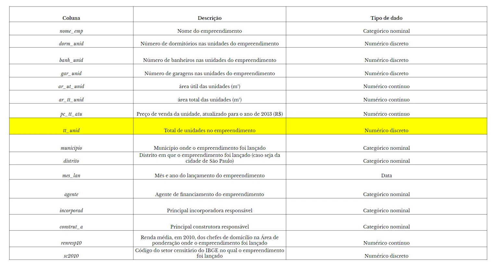

A base de dados da EMBRAESP contém os códigos do setor censitário e área de ponderação, tipicamente utilizados em censos do IBGE, o que permite a obtenção de variáveis externas, típicas dos trabalhos do instituto de pesquisa. Neste trabalho foram concatenados dados do Censo Demográfico de 2010, realizado pelo IBGE e obtidos através do [Base dos Dados](https://basedosdados.org/dataset/br-ibge-censo-demografico?bdm_table=microdados_domicilio_1970); o tratamento dos dados foi realizado em um código à parte, que pode ser visualizado [aqui](CENSO_2010.ipynb), As variáveis obtidas a partir do censo demográfico dizem respeito ao número de domicílios no setor censitário do empreendimento, o tipo de ocupação nesses domicílios (por número de habitantes em unidade), bem como etnia e renda da população.

O resultado final deste trabalho apontou que o uso das variáveis do censo não foi tão proveitoso no sentido da precificação das unidades, assim, essas variáveis não serão descritas a fundo, embora seja encorajado o aprofundamento posterior no estudo desses dados.

## 3. EDA (Análise Exploratória dos Dados)

A base obtida a partir dos dados levantados pela EMBRAESP contém uma matriz vasta (16935, 85), com várias colunas de dados únicos (como dados de identificação, CEP, nome do empreendimento, entre outros), além de colunas com números faltantes, assim, antes de começar a visualizar os dados e extrair leituras, é importante fazer ajustes a fim de criar uma base mais consistente. Inicialmente são removidas as colunas com dados de identificação ou com um número de valores nulos maior que o da metade das observações. O código de EDA está disponível, na íntegra, aqui.

```python
#Removendo colunas categóricas com dados muito fragmentados e que não oferecem boa leitura pela alto grau de cardinalidade
df = df.drop(['NOME_EMP','CEP','SETOR', 'QUADRA', 'LOTE', 'COD_EMP', 'ENDERECOCO', 'LOGRADOURO', 'NUM','CEP_4DIG', 'ENGENHEIRO', 'ARQUITETO', 'HOTELARIA', 'INCOPORADO', 'TIT_VIA', 'PCMEDAU91','PCMEDAU00','PCMEDAU10'], axis=1)
df.info()

#Removendo colunas de incorporadora, vendedoras e construtoras secundárias no processo dos edifícios. Na maior parte das linhas só há dados
# para os agentes primários e os agentes secundários tem muitos nulos
remover = []
for col in df.columns:
    for nome in ['INCORPOR_', 'VENDEDOR', 'CONSTRUT_']:
        remover.append(col) if nome in col and col != ('INCORPOR_A' or 'CONSTRUT_A') else None

#As variáveis de distrito e subprefeitura só fazem menção aos locais dentro da cidade de São Paulo, então coloquei os valores nulos como "Fora de São Paulo", apenas para facilitar a manipulação posterior
df[['DIST', 'SUBPREF']] = df[['DIST', 'SUBPREF']].fillna('FORA-SP')

#Colunas numéricas que na verdade são categóricas
for col in ['COOPERATIV', 'HOTEL', 'FLAT', 'EXFLAT']:
    df[col] = df[col].astype(dtype='category')
```

A exclusão das colunas gera um dataset com 52 features, um número que é consideravelmente menor que o da base original mas que não é o número final, uma vez que ainda são adicionadas as features relacionadas aos dados do IBGE. Os dados da base do censo foram adicionados à base principal e foram criadas features dos percentuais dos dados (uma vez que os valores absolutos eram consideravelmente distintos entre os setores censitários), o dataframe da análise acabou contando com 75 colunas, é pouco menor que a base obtida inicialmente, mas as categorias certamente podem ser mais interessantes para as análises quantitativas.

Uma última adequação de colunas que cabe mencionar nessa etapa é a modificação dos rótulos das incorporadoras, construtoras e dos agentes de financiamento; o mercado imobiliário na região de São Paulo é considerado muito fragmentado, isso é, ainda que existam grandes empreiteiras, incorporadoras e construtoras, não existem grupos dominantes da produção e os agentes que atuam na construção são numerosos. A verificação da base aponta que existem 3037 entradas diferentes para as empresas responsáveis pela construção dos empreendimentos e 4576 entradas únicas para os nomes das incorporadoras, a averiguação desses dados mostra que, em fato, as maiores construtoras e incorporadoras (em número de empreendimentos lançados) não tem uma quantidade expressiva de lançamentos em relação ao total da base:

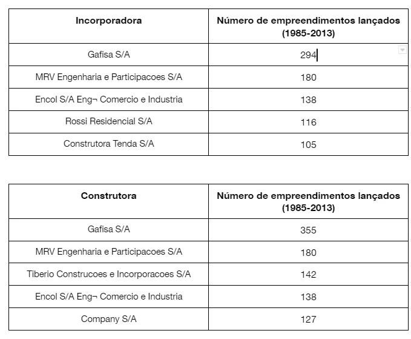

Como esses dados podem ser importantes para a definição de preços do mercado, uma vez que construtoras e incorporadoras tendem a ter um aporte financeiro maior e condições facilitadas de lançamento, optou-se pela classificação de incorporadoras e construtoras em dois grupos, entre as 50 maiores empresas e as demais.

```python
#A cardinalidade de incorporadoras e construtoras é muito alta porque existe um mercado grande em São Paulo. Assim, agrupei as duas categorias
#A partir da soma do valor de mercado dos empreendimentos, separando entre as 50 maiores e as restantes. Cada uma das features contava originalmente com cerca
#de 500 entradas diferentes
df_incorporadoras = df.groupby(df['INCORPORAD']).sum()
df_incorporadoras = df_incorporadoras.sort_values('PC_EMP_ATU', ascending=False)

#Cria a lista das maiores e menores incorporadoras
incorporadoras_maiores = incorporadoras_maiores.index.to_list()

#Verifica, em cada linha, a qual grupo as incorporadoras pertencem
for idx, linha in df.iterrows():
    if linha['INCORPORAD'] in incorporadoras_maiores:
        df.at[idx, 'INCORPORAD'] = 'MAIORES INCORPORADORAS'
    else:
        df.at[idx, 'INCORPORAD'] = 'iNCORPORADORA MENOR'
```
Uma situação análoga foi identificada para a coluna de “AGENTE”, relacionada aos agentes de financiamento do empreendimento. Nesse caso, o processo de preenchimento seguiu a mesma lógica de criar rótulos mais genéricos, a fim de evitar a fragmentação, assim, os agentes foram divididos em “Público”, “Privado” e “Sem informação”.

Com as features ajustadas, é hora de gerar algumas visualizações das variáveis, a fim de compreender melhor a base. Para a visualização inicial dos gráficos são gerados gráficos do modelo Boxplot para as variáveis categóricas e histogramas para as variáveis numéricas, essas imagens ajudam a compreender a distribuição dos dados.

```python
#Dado uma lista de colunas e um dataframe, a função plota os histogramas de cada uma das variáveis listadas
def plot_hist_variaveis(conjunto, dataframe, i=0):
    total_plots = len(conjunto)
    fig = plt.figure(figsize=(15,90), facecolor='white')
    fig.subplots_adjust(hspace=0.6, wspace=0.3)

    for var in conjunto:
        ax = fig.add_subplot(total_plots, 2, i+1)

        sns.distplot(x=dataframe[var], ax=ax, color='#435058')
        ax.axvline(x=dataframe[var].mean(), linestyle='--', color='red')
        ax.set_title(var + '. Média = {}'.format(round(dataframe[var].mean(), 2)))
        ax.set_ylabel('')
        ax.set_xlabel('')
        i += 1

#Dado uma lista de colunas e um dataframe, a função plota os boxplots de cada uma das variáveis listadas
def plot_bp_variaveis(conjunto, dataframe,resposta, i=0):
    total_plots = len(conjunto)
    fig = plt.figure(figsize=(30,90), facecolor='white')
    fig.subplots_adjust(hspace=0.2, wspace=0.3)

    for var in conjunto:
        ax = fig.add_subplot(total_plots, 2, i+1)

        sns.boxplot(x=dataframe[var], ax=ax, y=dataframe[resposta], color='#435058')
        ax.set_title(var)
        ax.set_ylabel('')
        ax.set_xlabel('')
        ax.set_ylim(0,np.percentile(dataframe[resposta], 98)) #O limite do percentil no eixo Y é para melhoria da visualização
        plt.xticks(rotation=90)
        i += 1
```


A distribuição das variáveis categóricas aponta alguns insights interessantes: primeiro, mostra que algumas categorias, como a zona, o tipo de via e o sistema financeiro, apresentam grande variação no preço do imóvel. As duas primeiras têm relação direta com a localização do empreendimento, no caso da Zona, a diferenciação do preço do imóvel faz total sentido, uma vez que são concedidos incentivos financeiros para a construção a algumas áreas da cidade e restrições em outras, a partir da [Plano Diretor Estratégico (PDE)](https://www.google.com/url?sa=t&rct=j&q=&esrc=s&cd=&ved=2ahUKEwiZnrTN2__9AhVFFbkGHaalDK0QFnoECCUQAQ&url=https%3A%2F%2Fgestaourbana.prefeitura.sp.gov.br%2Fmarco-regulatorio%2Fplano-diretor%2Ftexto-da-lei-ilustrado%2F&usg=AOvVaw0l_ldT6ZmyN-7gG-a4FlI0) do município. Zonas de Estruturação Urbana e próximas aos grandes centros e corredores de mobilidade têm incentivo para o adensamento e a construção acaba se tornando mais rentável. Por outro lado, as Zonas Especiais de Interesse Social (ZEIS), por exemplo, têm um valor de unidade muito menor, uma vez que embora tenham incentivos para construção destinam-se à criação de unidades habitacionais para grupos de baixa renda. Ainda falando sobre localização, os gráficos indicam que o distrito da cidade tem uma grande relação com o valor do imóvel, mas a leitura é dificultada devido à alta cardinalidade dos dados.

O sistema financeiro é outra variável que apresenta grande distinção em relação ao preço final do imóvel. Essa categoria apresenta um bom indicativo dos custos na realização de um empreendimento, imóveis a preço de custo, por exemplo, requerem alto investimento inicial, uma vez que os empreendedores arcam diretamente com o preço do produto. Por outro lado, empreendimentos com possibilidade de financiamento tendem a ter preço de venda menor, uma vez que os valores da construção são diluídos.

Verificando os valores numéricos, a inspeção da base aponta irregularidade na distribuição dos dados para uma série de variáveis, grande parte dos histogramas visualizados tem cauda alongada para a direita, o que aponta uma diferença muito grande entre a grande maioria das observações (seguramente as entre o primeiro e terceiro quartil) e os valores máximos encontrados na base. Para várias dessas colunas os valores mais altos são relacionados a lançamentos de mercado de luxo e são outliers, pois são discrepantes ao resto da base, mas acabam por influenciar a média de toda a distribuição para cima, a averiguação dessa discrepância dos dados é possível através da verificação da diferença entre média e mediana.


Tomando o caso da área, por exemplo, a média aponta 102.15m² por unidade, mas na mediana esse valor é consideravelmente menor, 74m², essa discrepância se dá porque existem alguns apartamentos muito grandes, o maior apartamento da base tem 1925m². Falando sobre a variável resposta, essa apresenta valor médio de R$656.059,00, no entanto a mediana tem valor consideravelmente menor, R$384.849,00; o valor máximo de uma unidade ultrapassa R$3,1 milhões.

Para a melhor visualização dos gráficos e performance de modelos futuros, os valores acima do 95 percentil de cada variável numérica foram definidos como exatamente esse valor. Pegando o exemplo da variável resposta, após essa transformação o valor de média era de R$573.792,00, consideravelmente menor que o anterior.

Como grande parte dos dados estavam desbalanceados, foram aplicadas transformações logarítmicas nas variáveis de preço, uma vez que essas são as mais interessantes para o entendimento da análise e a criação de modelos, especialmente do modelo de regressão linear que será discutido mais à frente. A inspeção das variáveis logarítmicas mostra que as distribuições ficaram muito mais normalizadas, inclusive a distribuição da variável resposta.

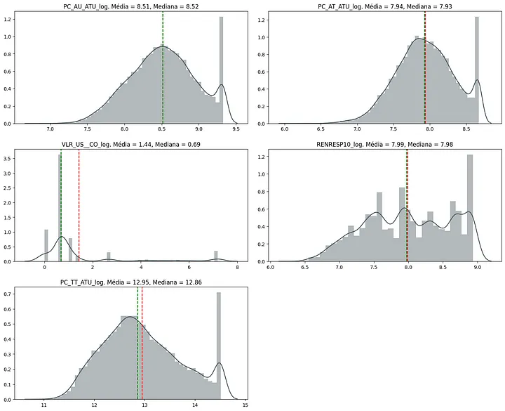

Por fim, alguns dados temporais e de localização foram agrupados para a melhor visualização das leituras. A análise dos gráficos categóricos indicou uma diferenciação muito grande da variável de análise a partir da localização na cidade, assim, os dados das subprefeituras foram agrupados a partir das regiões da cidade de São Paulo, de modo a melhorar a verificação das diferenças entre os territórios.

```python
regioes = {'Centro': ['SE'],
           'Nordeste': ['CASA VERDE', 'SANTANA / TUCURUVI', 'VILA MARIA / VILA GU', 'JACANA / TREMEMBE'],
           'Noroeste': ['FREGUESIA DO O ', 'PIRITUBA / JARAGUA', 'PERUS'],
           'Oeste': ['BUTANTA', 'PINHEIROS', 'LAPA'],
           'Centro-Sul': ['VILA MARIANA', 'JABAQUARA', 'SANTO AMARO'],
           'Sul': ['CAMPO LIMPO', 'M BOI MIRIM', 'PARELHEIROS', 'CAPELA DO SOCORRO', 'CIDADE ADEMAR'],
           'Sudeste': ['IPIRANGA', 'VILA PRUDENTE', 'ARICANDUVA', 'MOOCA'],
           'Leste 1': ['PENHA', 'ERMELINO MATARAZZO', 'ITAQUERA', 'SAO MATEUS'],
           'Leste 2': ['SAO MIGUEL', 'ITAIM PAULISTA', 'GUAIANASES', 'CIDADE TIRADENTES'],
           'RMSP': ['FORA-SP']
}

regioes = {valor:chave for chave, lista in regioes.items() for valor in lista}
df['REGIAO'] = df['SUBPREF'].map(regioes)

#Dataframes com os filters de cada região, são utilizados para verificar cada região separadamente a seguir
df_sul = df.query('REGIAO == "Sul"')
df_noroeste = df.query('REGIAO == "Noroeste"')
df_nordeste = df.query('REGIAO == "Nordeste"')
df_centrosul = df.query('REGIAO == "Centro-Sul"')
df_sudeste = df.query('REGIAO == "Sudeste"')
df_leste1 = df.query('REGIAO == "Leste 1"')
df_oeste = df.query('REGIAO == "Oeste"')
df_centro = df.query('REGIAO == "Centro"')
df_leste2 = df.query('REGIAO == "Leste 2"')
```

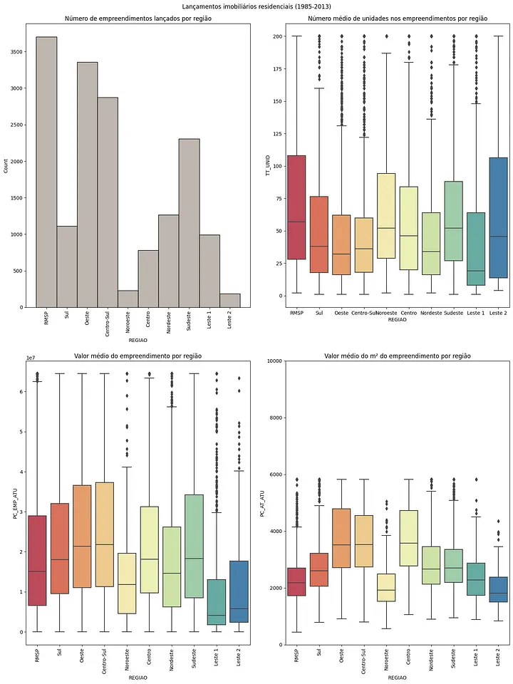
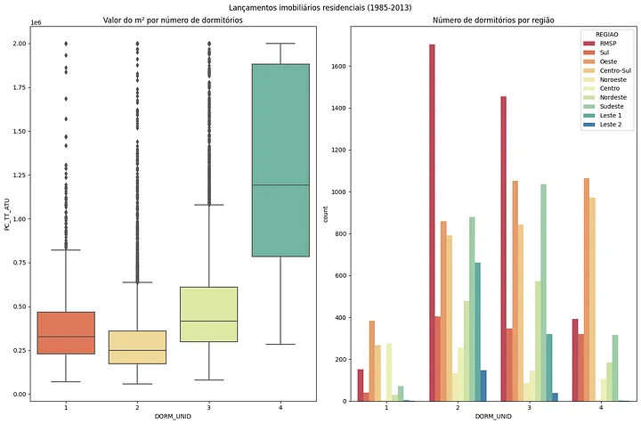

A visualização desses gráficos explicita a diferenciação dos empreendimentos a partir da localização na cidade de São Paulo. O número de empreendimentos lançados é muito distinto para cada região, com poucos números na região leste 2 e nordeste, os valores de m2 e do empreendimento também acabam sendo menores nessas áreas. Em contraste, regiões como oeste e centro-sul concentram grande número de empreendimentos, com preços mais elevados. As regiões da cidade com maior número de empreendimentos são, também, as com maior renda média dos responsáveis de domicílios.

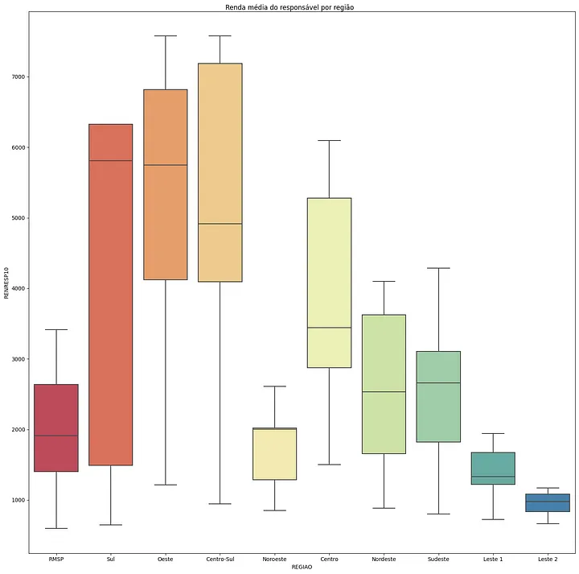

Cabe, ainda, considerar a variação dos empreendimentos ao longo do tempo, visto o longo período de obtenção dos dados. Pela análise temporal dos dados é possível verificar que o número de empreendimentos cresceu ao longo da série e a tipologia provavelmente foi alterada, aparecendo empreendimentos com menor número de dormitórios e de área útil da unidade. É notória a flutuação no preço do m², que parece entrar em ascensão a partir dos últimos anos da série histórica.

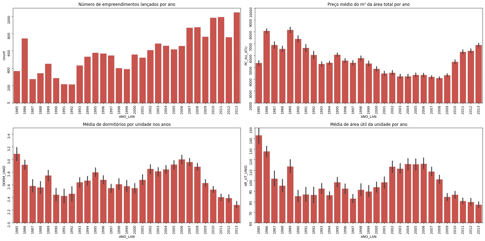

Com a correção preliminar da base realizada e as leituras ajudando a interpretar melhor o quadro do mercado imobiliário em São Paulo, é hora de trabalhar os modelos de Machine Learning.

## 4. Machine Learning para entendimento e previsão dos preços

### 4.1 Modelo de interpretação do valor do imóvel
Utilizando a versão logarítmica da variável de preço da unidade para resposta e a [base trabalhada durante a fase de EDA](https://github.com/LissesCastro/Tera-Mercado-Imobiliario-SP/blob/main/Base_EMBRAESP_Trabalhada.csv) para as demais variáveis, foram criados modelos de regressão linear para a interpretação da variação dos preços das unidades em São Paulo. O modelo de regressão linear é particularmente potente para o entendimento dos problemas de negócio, mas é menos competitivo na predição dos preços, assim, nessa etapa a prioridade é a utilização do modelo para o entendimento dos coeficientes relacionados às variáveis testadas. O código do processo de regressão linear (bem como o do modelo preditivo, mais a frente nesse texto) está disponível aqui

O primeiro modelo foi testado utilizando um conjunto baseline de variáveis, composto pela área total da unidade, o número de dormitórios e o número de banheiros, variáveis fundamentais no entendimento de qualquer unidade habitacional. Os resultados do baseline são apresentados a seguir:

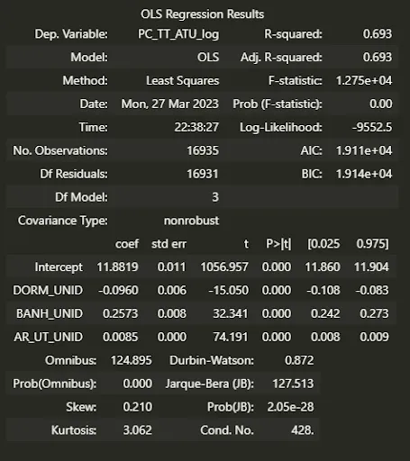

Todas as variáveis foram consideradas significantes na determinação do preço e o R² aponta que esse conjunto explica cerca 69% da modificação dos preços. É um baseline muito bom a partir dessa métrica, mas tem de ser olhado com cautela: Apesar do ótimo índice, os coeficientes apresentam valores estranhos: o modelo está nos dizendo que o incremento de um dormitório na unidade habitacional diminui o preço da mesma em cerca de 9,6%. Faz sentido? É intuitivo pensar que uma unidade com mais dormitórios será vendida por um maior preço, então o modelo pode estar apresentando algum erro de leitura.

A fim de melhorar as métricas e a interpretação do modelo, foram testadas diversas combinações das variáveis preditoras, esse trabalho foi realizado com o apoio de matrizes de correlação, mas a combinação dos parâmetros foi majoritariamente manual. No melhor teste obtido, o conjunto das variáveis preditivas e o modelo obtido são apresentados a seguir:

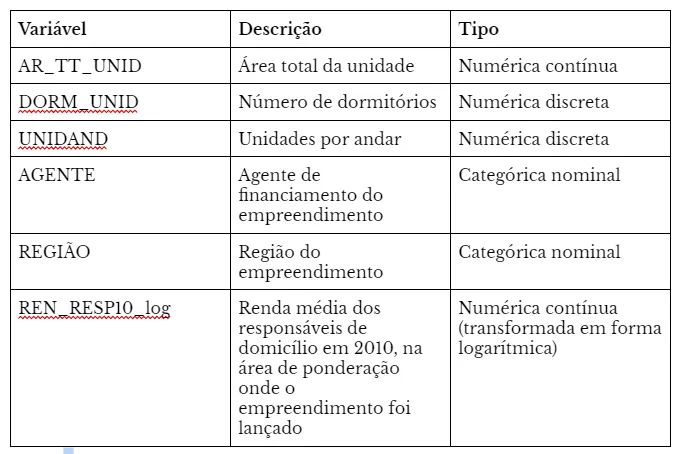

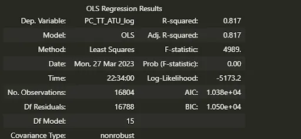
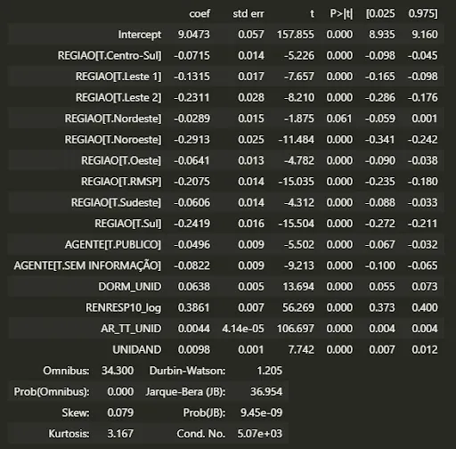

Seguindo o modelo, a interpretação Ceteris Paribus das variáveis é:
- Cada m² de área total construída aumenta o preço do imóvel em cerca de 0.44%

- A existência de um dormitório adicional na unidade aumenta seu preço em 6.38%

- A existência de uma unidade adicional no mesmo andar aumenta o preço em cerca de 0.98%

- O incremento de 1% na renda média dos responsáveis na área de ponderação do imóvel atribui ao valor do imóvel aumento de cerca de 0.38%

- Comparando com a região central de São Paulo, a escolha de outra região afeta o preço negativamente entre 6.00% e 29.13%, a escolha de outra cidade diminui o preço em 20%

- O financiamento da unidade por agente público diminui cerca de 4.9% do valor da unidade
  
Ao analisar a matriz de correlação das variáveis preditoras, nota-se que as variáveis apresentam um nível razoável de correlação, mas como essas variáveis são consideradas elementares na precificação imobiliária, optou-se por mantê-las. A variável do número de banheiros foi retirada porque sua inserção aumentava largamente o VIF e o índice de colinearidade do modelo, sem apresentar mudança significativa na leitura.

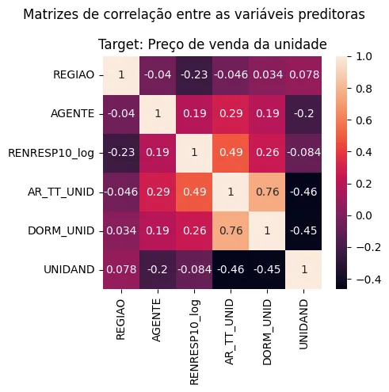

A verificação dos gráficos de validação do modelo de regressão linear indicam que a distribuição é aproximadamente homocedástica, isso é, a dispersão dos erros é relativamente homogênea ao longo do eixo das predições, além disso, distribuição dos resíduos também apresenta distribuição próxima à normalidade. O gráficos da distribuição dos erros apontam que os erros na predição do valor do imóvel são bem altos, esses erros serão minimizados a partir dos modelos de predição.

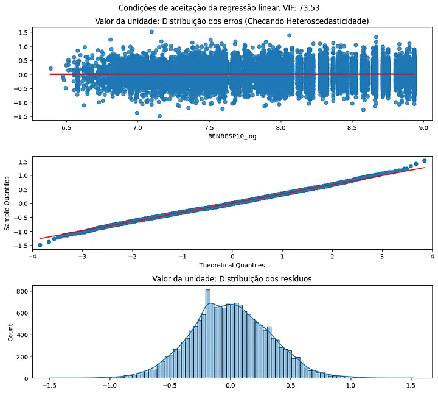

### 4.2 Modelo de predição do valor do imóvel

Após o split do dataframe em treino e teste (80/20), o modelo de predição foi treinado para a variável target — no caso, a variável de preço da unidade — em forma absoluta. Nessa etapa foram removidas algumas das features do dataframe, pensando que seriam colunas que prejudicam a performance do modelo, uma vez que aumentam o número total de colunas sem apresentarem impacto positivo na variável resposta ou que estão largamente correlacionadas ao preço da unidade e poderiam levar o modelo a uma situação de overfitting.

```python
#Removi colunas que não seriam de nenhum interesse para os modelos preditivos (como ID e as "Unnamed") e também colunas de preço que poderiam influenciar fortemente o modelo ao ovemodeloitting
#Base que será utilizada para o split

#Dataframe utilizado nos modelos preditivos
df_modelo = df.drop(['Unnamed: 0.1', 'Unnamed: 0',
       'RENRESP00', 'ID', 'PC_TT_UN', 'PC_M2_AU', 'PC_M2_AT', 'PC_AT_ATU','ANO_LAN', 'MES_LAN',
       'VLR_US__CO', 'PC_TT_UN_U', 'PC_M2_AU_U', 'PC_M2_AT_U', 'PC_M2_AT_log', 'VLR_US__CO_log', 'PCMEDAU10_log', 'PC_M2_AU_log', 'PC_AU_ATU', 'PC_AU_ATU_log',
       'DATA_ENT','PERC_PPI', 'PERC_4_MAIS_MORADORES',
       'Brancos', 'Pretos', 'Amarelos', 'Pardos', 'Índigenas', 'Domicilios no setor censitário', 'Domicilios alugados',
       'Domicilios unipessoais', 'Domicilios 2 ou 3 moradores','Domicilios 4 ou mais moradores', 'Residentes no setor censitário', 'SC_2010', 'AP2010', 'BANH_DORM', 'Domicílios_Setor',
       'UNIDAND', 'DORM_EMP',  'BLOCOS', 'Média_Moradores_por_domicilio_setor', 'REGIAO',
       ], axis=1)

#Criação de features logaritmicas que podem ajudar na resposta da interpretação e predição
df['AR_UT_UNID_log'] = np.log(df['AR_UT_UNID'])
df['RENRESP10_log'] = np.log(df['RENRESP10'])
df_modelo['AR_UT_UNID_log'] = np.log(df['AR_UT_UNID'])
df_modelo['RENRESP10_log'] = np.log(df['RENRESP10'])
```

O baseline do modelo preditivo do preço da unidade foi estimado a partir de quatro algoritmos iniciais de regressão: [RandomForestRegressor](https://scikit-learn.org/stable/modules/generated/sklearn.ensemble.RandomForestRegressor.html), [SGDRegressor](https://scikit-learn.org/stable/modules/generated/sklearn.linear_model.SGDRegressor.html), [HistGradientBoostingRegressor](https://scikit-learn.org/stable/modules/generated/sklearn.ensemble.HistGradientBoostingRegressor.html) e [LinearRegression](https://scikit-learn.org/stable/modules/generated/sklearn.linear_model.LinearRegression.html). Os algorítmos de Emsembles (RandomForestRegressor e HistGradientBoostingRegressor) foram escolhidos pela conhecida boa performance na diminuição do erro de regressão, o algoritmo de regressão linear é análogo ao usado na fase anterior e o SGDRegressor é um modelo que utiliza gradiente descendente estocástico para continuadamente atualizar os pesos do modelo, funcionando bem em dataframes maiores.

Como na etapa anterior procurou-se criar uma interpretação sobre o impacto das variáveis no preço, nesta a ênfase é em acertar o preço de venda da unidade, assim, o modelo de regressão continuado é com menor RMSE no baseline.

Previamente à criação dos três modelos foram retirados os outliers da base, resultando em 15377 observações. Também foi realizado um pipeline de modificação dos dados, aplicando códigos numéricos às variáveis categóricas, preenchendo os nulos, e padronizando a escala dos dados, no caso das variáveis numéricas:

```python
#Instanciando os pipelines de tratamento das variáveis do dataframe

#Tratamento categórico: Labelizando variáveis
le = LabelEncoder()
for col in X_train.select_dtypes(exclude=['number', 'datetime']).columns.tolist():
    X_train[col] = le.fit_transform(X_train[col])
    X_test[col] = le.fit_transform(X_test[col])

#Tratamento numérico: input de dados faltantes e scaler
num_pipeline = Pipeline(steps=[
    ("input", SimpleImputer(strategy='median')),
    ('scaler', RobustScaler()),
    ])

#Column transformar aplicando os pipelines em todas as variáveis indicadas anteriormente
preprocessing = ColumnTransformer(transformers=[
    ('preprocessamento numerico', num_pipeline, numericas2)
])

#Pipeline aplicando o pré-processamento e testando diferentes modelos
for algorithm in [ RandomForestRegressor,SGDRegressor, LinearRegression, HistGradientBoostingRegressor]:
    if algorithm == LinearRegression:
        model = Pipeline(steps=[('Preprocessamento', preprocessing),
        ('regressao', algorithm())])
        model.fit(X_train, y_train) #inserir ou remover o
        y_pred = model.predict(X_test)
        rmse = math.sqrt(mean_squared_error(y_test, y_pred))
        print('RMSE ({}): {:.2f}'.format(algorithm.__name__, rmse, 2))
    else:
        model = Pipeline(steps=[('Preprocessamento', preprocessing),
        ('regressao', algorithm(random_state=42))])
        model.fit(X_train, y_train) #inserir ou remover o
        y_pred = model.predict(X_test)
        rmse = math.sqrt(mean_squared_error(y_test, y_pred))
        #rmse_exp = np.exp(rmse_log) #Usar em caso de log

        print('RMSE ({}): {:.2f}'.format(algorithm.__name__, rmse, 2))
```

Os valores do RMSE dos modelos baseline são apresentados a seguir, o HistGradientBoostingRegressor adquiriu uma performance notadamente melhor que a dos outros modelos:

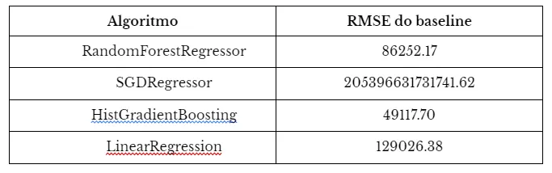

Considerando que os parâmetros podem melhorar significativamente a performance do modelo, foi realizada hiperparametrização a partir dos métodos RandomizedSearchCV e GridSearchCV. Ambos são métodos que testam continuamente conjuntos de parâmetros em um modelo, com a diferença fundamental de que o primeiro testa uma quantidade aleatória de conjuntos, enquanto o segundo testa todos os conjuntos possíveis.

A ideia foi atribuir um range de parâmetros para o RandomizedSearchCV a partir dos valores padrões do modelo, são realizados, então, 100 testes aleatórios de parâmetros a fim de adquirir um range ainda menor de parâmetros para serem usados no GridSearch. No GridSearch foram consideradas modificações consideravelmente menores nos parâmetros, uma vez que esse método demanda muito processamento da máquina.

```python
#Número máximo de estimadores
max_iter = [int(x) for x in np.linspace(start=100, stop=1000, num=20)]
#Alpha da regressão de Ridge
l2_regularization = [int(x) for x in np.linspace(start=0, stop=100, num=20)]
#Profundidade de cada árvore
max_depth = [int(x) for x in np.linspace(1, 100, 10)]
#Número mínimo de folhas
min_samples_leaf = [5, 10, 20, 40, 100]
#Taxa de aprendizagem
learning_rate=[float(x) for x in np.linspace(start=0.1, stop=1, num=10)]

random_grid = {'regressao__max_iter': max_iter,
               'regressao__l2_regularization': l2_regularization,
               'regressao__max_depth': max_depth,
               'regressao__min_samples_leaf': min_samples_leaf,
               'regressao__learning_rate': learning_rate
                }
modeL_random = RandomizedSearchCV(estimator=model, param_distributions=random_grid, n_iter=100, cv=5, n_jobs=-1, random_state=42)
modeL_random.fit(X_train_tt, y_train_tt) #Adicionar ou retirar o _tt conforme modelo

#FAZENDO O GRID SEARCH
#GRID DO PREÇO DA UNIDADE
param_grid = {'regressao__max_iter': [1000, 1500],
               'regressao__l2_regularization': [int(x) for x in np.linspace(start=20, stop=75, num=3)],
               'regressao__max_depth': [int(x) for x in np.linspace(start=20, stop=40, num=3)],
               'regressao__min_samples_leaf': [int(x) for x in np.linspace(start=20, stop=40, num=3)],
               'regressao__learning_rate': [0.1, 0.05] #Apenas em GBosst
                }


grid_search = GridSearchCV(estimator=model, param_grid=param_grid, cv=5, n_jobs=-1)
grid_search.fit(X_train, y_train) #Retirar ou colocar o  dependendo de qual modelo está sendo trabalhado
```

Após a execução do GridSearch, os parâmetros utilizados no modelo foram:

> l2_regularization’: 20, learning_rate’: 0.05, max_depth’: 20, max_iter’: 1500,min_samples_leaf’: 20

E as métricas obtidas foram as seguintes:

> RMSE: 38.987,13, MAE: 22.983,96, R²: 0.98, MAPE: 0.05, AVG_TARGET: 448.767,00, AVG_PREDICTION: 447.582,00

Assim, é possível interpretar que o modelo responde, com 98% de explicação, que o preço médio da variável predita é de cerca de 447 mil reais, muito próximo dos 448 mil da base de teste. O modelo erra cerca de 39 mil reais na previsão do preço de cada unidade, um valor consideravelmente alto mas que equivale a menos de 10% do valor médio dos imóveis. Apesar do alto valor de R², é possível que o modelo esteja em uma situação de overfitting e que o modelo esteja performando muito melhor na base de treino do que estaria em produção, assim, é necessário um teste para averiguar a confiança das predições do modelo.

Para a verificação do teste foi utilizado o método de validação cruzada, onde foram criadas 100 partições de dados, de modo que o modelo realizou a previsão para cada uma dessas, a partir do treino em outras 99. O valor final do erro estipulado pelo RMSE após a validação cruzada foi de R$40.678, equivalente a 9.09% do valor médio das predições.

```python
score_final = cross_val_score(best_estimator, X_train, y_train, cv=100, scoring='neg_mean_squared_error', n_jobs=-1)
print("RMSE: %0.2f (%0.2f%%) (+/- %0.2f)" % (np.sqrt(abs(score_final.mean())), ((np.sqrt(abs(score_final.mean()))/np.mean(y_pred))*100) ,np.sqrt(score_final.std()) * 2))
```

Por último, é possível ainda uma visualização gráfica da performance do modelo para certificar que o modelo criado funciona bem para a previsão de novos dados; nesse caso, foram obtidos a curva de aprendizado do modelo e o gráfico de dispersão de resíduos. A curva de aprendizado aponta que o modelo alcança o platô de R² = 0.98 a partir do treino de aproximadamente 10 mil observações, em uma distribuição gráfica comum seguindo a documentação. O gráfico de dispersão dos resíduos aponta que eles têm uma distribuição significativamente homogênea ao longo das predições do preço da unidade, indicando a consistência da predição dos valores pelo modelo.

```python
#Plota a curva de aprendizado
common_params = {
    "X": X_train_tt,
    "y": y_train_tt,
    "train_sizes": np.linspace(0.1, 1.0, 5),
    "cv": ShuffleSplit(n_splits=50, test_size=0.2, random_state=0),
    "score_type": "both",
    "n_jobs": -1,
    "line_kw": {"marker": "o"},
    "std_display_style": "fill_between",
    "score_name": "R2",
}
LearningCurveDisplay.from_estimator(best_estimator, **common_params)
#    '''handles, label = ax[ax_idx].get_legend_handles_labels()
#    ax[ax_idx].legend(handles[:2], ["Training Score", "Test Score"])
#    ax[ax_idx].set_title(f"Learning Curve for {estimator.__class__.__name__}")'''

#Plota o gráfico de resíduos
sns.residplot(x=y_test_tt, y=y_pred)
```
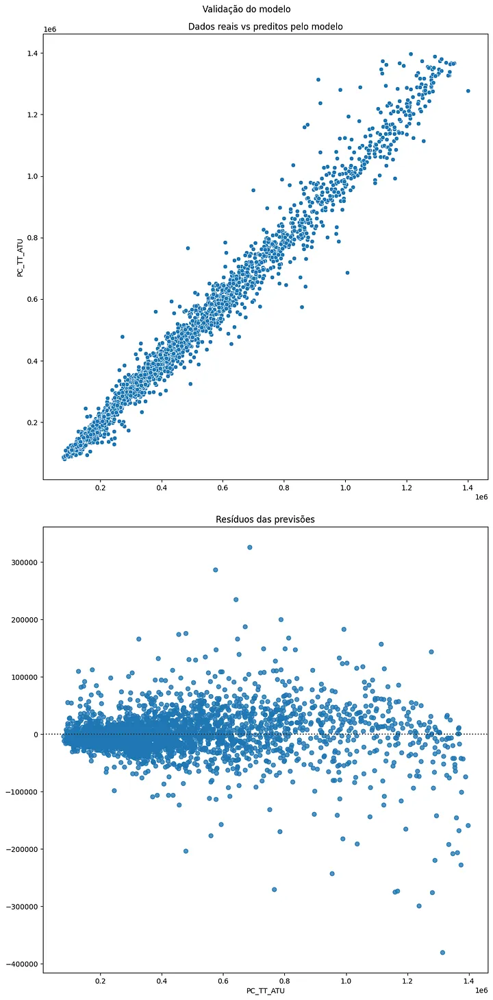

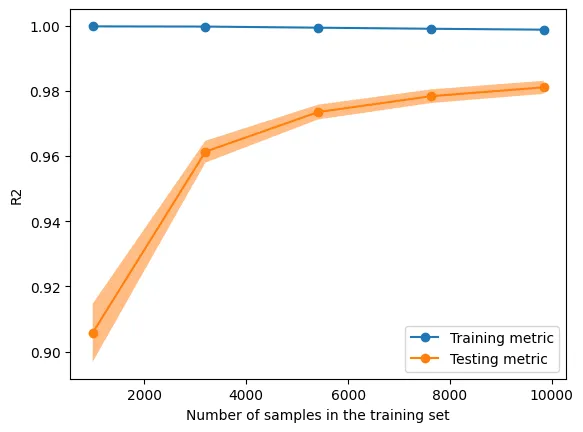

## 5. Conclusão

Os modelos treinados ao longo do artigo conseguiram chegar a respostas satisfatórias sobre a composição do preço da unidade e alcançaram valores relativamente aproximados na predição dos preços das unidades.

Certamente, uma diferença de valor de aproximadamente 40 mil reais é muito significativa na estipulação de um negócio, mas esse erro foi obtido a partir de uma base com variáveis limitadas, que não contém informações do custo de produção relacionado, por exemplo, à mão de obra e ao preço dos materiais. Além disso, existem variações no tempo e na localização dos empreendimentos que podem demandar outras estratégias além das utilizadas nesse artigo para a precificação das unidades: um modelo de Séries Temporais pode capturar bem a variação ano a ano dos empreendimentos e mesmo prever valores, uma outra alternativa é prever os valores para cada região, visto que estes alteram largamente.

Por fim, esse trabalho indica que a leitura sobre o mercado imobiliário é complexa, mas certamente pode ser destrinchada por meio de Machine Learning. Na resolução dos problemas são necessárias considerações sobre o tipo do imóvel, o valor de renda disponível do comprador, o ano do lançamento, a localização do edifício, entre outras informações.