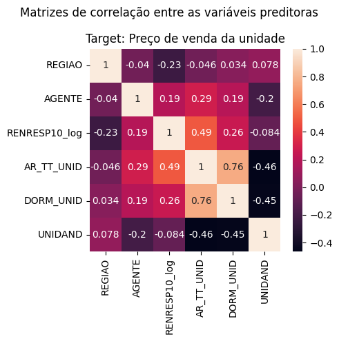
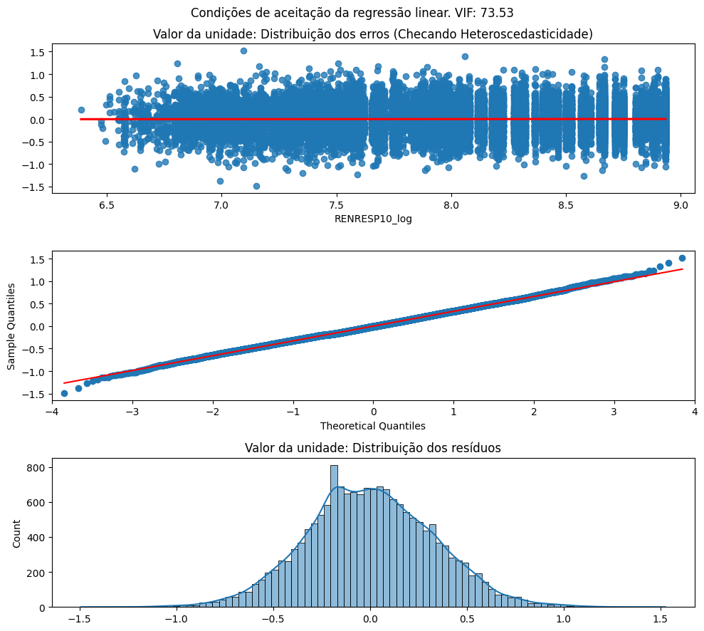
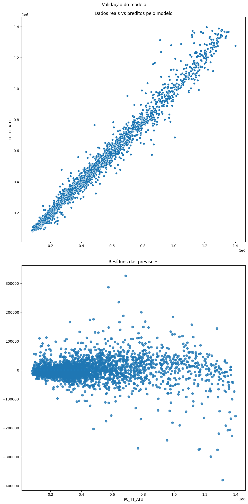
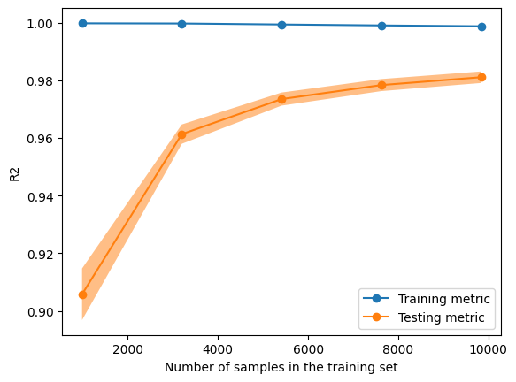

# Valor do imóvel em São Paulo - Modelo preditivo

- [Valor do imóvel em São Paulo - Modelo preditivo](#valor-do-imóvel-em-são-paulo---modelo-preditivo)
  - [0. Pré-processamento](#0-pré-processamento)
    - [0.1 Importação das bibliotecas](#01-importação-das-bibliotecas)
    - [0.2 Pré-definição de funções](#02-pré-definição-de-funções)
  - [1. Leitura e processamento do dataframe](#1-leitura-e-processamento-do-dataframe)
    - [1.1 Definindo as variáveis que estarão presentes no modelo](#11-definindo-as-variáveis-que-estarão-presentes-no-modelo)
  - [2. Interpretando a formulação dos preços dos imóveis - Modelos de regressão linear](#2-interpretando-a-formulação-dos-preços-dos-imóveis---modelos-de-regressão-linear)
    - [2.1 - Criando o baseline](#21---criando-o-baseline)
    - [2.2 - Otimizando os modelos](#22---otimizando-os-modelos)
    - [2.3 - Verificando os requisitos de aceitabilidade do modelo](#23---verificando-os-requisitos-de-aceitabilidade-do-modelo)
      - [2.3.1 Multicolinearidade - Correlação entre variáveis e Variance Inflation Factor](#231-multicolinearidade---correlação-entre-variáveis-e-variance-inflation-factor)
      - [2.3.2 Verificando heteroscedasticidade e normalização/distribuição dos resíduos](#232-verificando-heteroscedasticidade-e-normalizaçãodistribuição-dos-resíduos)
  - [3. Descobrindo os valores de m² e unidade - Modelos de predição](#3-descobrindo-os-valores-de-m-e-unidade---modelos-de-predição)
    - [3.1 - Criação de pipelines para adequação das features e criação do primeiro modelo](#31---criação-de-pipelines-para-adequação-das-features-e-criação-do-primeiro-modelo)
    - [3.2 - Verificando overfitting por meio de validação cruzada](#32---verificando-overfitting-por-meio-de-validação-cruzada)
    - [3.3 - Hiperparametrização - selecionando o melhor conjunto de parâmetros para o modelo a partir de Random/Grid Search](#33---hiperparametrização---selecionando-o-melhor-conjunto-de-parâmetros-para-o-modelo-a-partir-de-randomgrid-search)
  - [4. Rodando o modelo na base de teste e verificando a performance](#4-rodando-o-modelo-na-base-de-teste-e-verificando-a-performance)
    - [4.1 Obtendo as métricas do modelo](#41-obtendo-as-métricas-do-modelo)
    - [4.2 Verificando overfitting e validando o modelo](#42-verificando-overfitting-e-validando-o-modelo)
  - [5. Conclusão](#5-conclusão)


## 0. Pré-processamento
### 0.1 Importação das bibliotecas
```python
#Bibliotecas core
import pandas as pd
import numpy as np
import math

#Statsmodel para criação dos modelos de regressão linear e avaliação das métricas
import statsmodels.formula.api as sm
import statsmodels.api         as sma
from statsmodels.stats.outliers_influence import variance_inflation_factor

#SKLearn para o split da base, pipeline com transformação das colunas, criação do modelo RandomForest e avaliação do mesmo
from sklearn.model_selection import train_test_split, RandomizedSearchCV, GridSearchCV, cross_val_score, LearningCurveDisplay, ShuffleSplit
from sklearn.linear_model import SGDRegressor, LinearRegression
from sklearn.compose import ColumnTransformer
from sklearn.ensemble import RandomForestRegressor, HistGradientBoostingRegressor
from sklearn.metrics import mean_squared_error, r2_score, mean_absolute_error, mean_absolute_percentage_error
from sklearn.pipeline import Pipeline
from sklearn.preprocessing import LabelEncoder, OrdinalEncoder, RobustScaler
from sklearn.impute import SimpleImputer
from sklearn.inspection import permutation_importance
from sklearn.feature_selection import RFE

#Bibliotecas para plot
import seaborn as sns
import matplotlib.pyplot as plt

# Configuração para mostrar os diagramas dos pipelines realizados com o SkLearn, apenas para melhorar a visualização de como o modelo está trabalhando.
from sklearn import set_config
set_config(display='diagram')

```

### 0.2 Pré-definição de funções
```python
#Funções utilizadas posteriormente no código

#FUNÇÃO PARA CALCULAR O VIF
def calc_vif(dataframe):
    vif = pd.DataFrame()
    vif['variables'] = dataframe.columns
    vif['VIF'] = [variance_inflation_factor(dataframe.values, i) for i in range(dataframe.shape[1])]
    return(vif)

#FUNÇÃO PARA EXIBIR AS MÉTRICAS DO MODELO
def imprimir_metricas (y, y_pred, dataset_name='valid'):
  mean_y = np.mean(y)
  mean_pred = np.mean(y_pred)

  rmse = round(math.sqrt(mean_squared_error(y, y_pred)), 2)
  mae = mean_absolute_error(y, y_pred)
  mse = mean_squared_error(y, y_pred)
  r2 = r2_score(y, y_pred)
  mape = mean_absolute_percentage_error(y, y_pred)
  
  report = pd.DataFrame({
    'metric': ['RMSE', 'MAE', 'MSE', 'R^2', 'MAPE', 'Avg. target', 'Avg. Prediction'],
    dataset_name: [rmse, mae, mse, r2, mape, mean_y, mean_pred]
  })

  report[dataset_name] = report[dataset_name].round(2)
  return report

#Função de transformação logaritmica
def log_transform(x):
      return np.log(x+1)
```

## 1. Leitura e processamento do dataframe


```python
#A leitura é realizada a partir de uma base trabalhada anteriormente. O código de EDA que resultou no base está no mesmo respositório desse caderno.
df = pd.read_csv('Base_EMBRAESP_trabalhada.csv')
```


```python
#Removi colunas que não seriam de nenhum interesse para os modelos preditivos (como ID e as "Unnamed") e também colunas de preço que poderiam influenciar fortemente o modelo ao ovemodeloitting
#Base que será utilizada para o split 

#Dataframe utilizado nos modelos preditivos
df_modelo = df.drop(['Unnamed: 0.1', 'Unnamed: 0',
       'RENRESP00', 'ID', 'PC_TT_UN', 'PC_M2_AU', 'PC_M2_AT', 'PC_AT_ATU','ANO_LAN', 'MES_LAN',
       'VLR_US__CO', 'PC_TT_UN_U', 'PC_M2_AU_U', 'PC_M2_AT_U', 'PC_M2_AT_log', 'VLR_US__CO_log', 'PCMEDAU10_log', 'PC_M2_AU_log', 'PC_AU_ATU', 'PC_AU_ATU_log',
       'DATA_ENT','PERC_PPI', 'PERC_4_MAIS_MORADORES',
       'Brancos', 'Pretos', 'Amarelos', 'Pardos', 'Índigenas', 'Domicilios no setor censitário', 'Domicilios alugados',
       'Domicilios unipessoais', 'Domicilios 2 ou 3 moradores','Domicilios 4 ou mais moradores', 'Residentes no setor censitário', 'SC_2010', 'AP2010', 'BANH_DORM', 'Domicílios_Setor',
       'UNIDAND', 'DORM_EMP',  'BLOCOS', 'Média_Moradores_por_domicilio_setor', 'REGIAO',
       ], axis=1)

#Criação de features logaritmicas que podem ajudar na resposta da interpretação e predição
df['AR_UT_UNID_log'] = np.log(df['AR_UT_UNID'])
df['RENRESP10_log'] = np.log(df['RENRESP10'])
df_modelo['AR_UT_UNID_log'] = np.log(df['AR_UT_UNID'])
df_modelo['RENRESP10_log'] = np.log(df['RENRESP10'])
```

### 1.1 Definindo as variáveis que estarão presentes no modelo

```python
#Indicação das targets de cada modelo
target = 'PC_TT_ATU' #Target: Preço total da unidade

#As variáveis numéricas e categóricas que acabam sendo utilizadas posteriormente nos modelos de regressão linear
numericas = ['ANO_LAN', 'DORM_UNID', 'BANH_DORM', 'AR_UT_UNID']
categoricas = ['REGIAO', 'TIPO_EMP', 'AGENTE', 'CONSTRUTOR', 'DIST', 'INCORPORAD', 'CONSTRUTOR'] #
features = numericas + categoricas

#Variáveis que serão utilizadas nos modelos preditivos, a distinção de tipo facilita o pipeline de mudanças
numericas2 = df_modelo.select_dtypes(['int', 'float']).columns
numericas2 = numericas2.drop(['PC_TT_ATU', 'PC_TT_ATU_log'])
categoricas2 = df_modelo.select_dtypes(['object', 'string']).columns

```


```python
#Preenchendo as variáveis categóricas com o valor mais frequente, visando evitar posteriores erros nos modelos preditivos
for col in categoricas2:
    df[col] = df[col].fillna(df[col].mode())


```

## 2. Interpretando a formulação dos preços dos imóveis - Modelos de regressão linear

A ideia com a criação do modelo de regressão linear é a de gerar uma leitura sobre a interpretação dos dados; nesse sentido, o mais importante nessa etapa é o entendimento dos coeficientes envolvidos e do impacto de cada um desses. Ao longo do trabalho vários modelos foram testados e optou-se pelo modelo com menor AIC/BIC e bom R², com todas as variáveis significantes.

### 2.1 - Criando o baseline
No modelo baseline foram consideradas variáveis que são intuitivamente conhecidas na descrição de um empreendimento imobiliário: o número de dormitórios, o número de banheiros e a área do apartamento.


```python
#Criando o modelo baseline. A ideia é que os modelos posteriores consigam um R² maior e AIC/BIC menores
baseline = sm.ols(formula='PC_TT_ATU_log ~ DORM_UNID + BANH_UNID + AR_UT_UNID', data=df).fit()

baseline.summary()
```


<table class="simpletable">
<caption>OLS Regression Results</caption>
<tr>
  <th>Dep. Variable:</th>      <td>PC_TT_ATU_log</td>  <th>  R-squared:         </th> <td>   0.693</td> 
</tr>
<tr>
  <th>Model:</th>                   <td>OLS</td>       <th>  Adj. R-squared:    </th> <td>   0.693</td> 
</tr>
<tr>
  <th>Method:</th>             <td>Least Squares</td>  <th>  F-statistic:       </th> <td>1.275e+04</td>
</tr>
<tr>
  <th>Date:</th>             <td>Wed, 29 Mar 2023</td> <th>  Prob (F-statistic):</th>  <td>  0.00</td>  
</tr>
<tr>
  <th>Time:</th>                 <td>15:07:19</td>     <th>  Log-Likelihood:    </th> <td> -9552.5</td> 
</tr>
<tr>
  <th>No. Observations:</th>      <td> 16935</td>      <th>  AIC:               </th> <td>1.911e+04</td>
</tr>
<tr>
  <th>Df Residuals:</th>          <td> 16931</td>      <th>  BIC:               </th> <td>1.914e+04</td>
</tr>
<tr>
  <th>Df Model:</th>              <td>     3</td>      <th>                     </th>     <td> </td>    
</tr>
<tr>
  <th>Covariance Type:</th>      <td>nonrobust</td>    <th>                     </th>     <td> </td>    
</tr>
</table>
<table class="simpletable">
<tr>
       <td></td>         <th>coef</th>     <th>std err</th>      <th>t</th>      <th>P>|t|</th>  <th>[0.025</th>    <th>0.975]</th>  
</tr>
<tr>
  <th>Intercept</th>  <td>   11.8819</td> <td>    0.011</td> <td> 1056.957</td> <td> 0.000</td> <td>   11.860</td> <td>   11.904</td>
</tr>
<tr>
  <th>DORM_UNID</th>  <td>   -0.0960</td> <td>    0.006</td> <td>  -15.050</td> <td> 0.000</td> <td>   -0.108</td> <td>   -0.083</td>
</tr>
<tr>
  <th>BANH_UNID</th>  <td>    0.2573</td> <td>    0.008</td> <td>   32.341</td> <td> 0.000</td> <td>    0.242</td> <td>    0.273</td>
</tr>
<tr>
  <th>AR_UT_UNID</th> <td>    0.0085</td> <td>    0.000</td> <td>   74.191</td> <td> 0.000</td> <td>    0.008</td> <td>    0.009</td>
</tr>
</table>
<table class="simpletable">
<tr>
  <th>Omnibus:</th>       <td>124.895</td> <th>  Durbin-Watson:     </th> <td>   0.872</td>
</tr>
<tr>
  <th>Prob(Omnibus):</th> <td> 0.000</td>  <th>  Jarque-Bera (JB):  </th> <td> 127.513</td>
</tr>
<tr>
  <th>Skew:</th>          <td> 0.210</td>  <th>  Prob(JB):          </th> <td>2.05e-28</td>
</tr>
<tr>
  <th>Kurtosis:</th>      <td> 3.062</td>  <th>  Cond. No.          </th> <td>    428.</td>
</tr>
</table><br/><br/>Notes:<br/>[1] Standard Errors assume that the covariance matrix of the errors is correctly specified.


Percebe-se que as variáveis relacionadas apenas ao apartamento explicam cerca de 54% da variável target e são consideradas significantes, no entanto, a verificação dos coeficiente cria uma leitura pouco intuitiva sobre o preço e aponta que a existência de um dormitório adicional na unidade diminui o preço em cerca de 11%

O estudo sobre a dinâmica imobiliária no mercado de São Paulo leva ao entendimento de que duas variáveis são cruciais para o entendimento do preço das unidades: O local do empreendimento e o ano de lançamento. O local do empreendimento importa porque uma cidade desigual como São Paulo contém uma alta variabilidade no preço da terra, que se reflete diretamente nos valores de compra e venda de aluguéis dos imóveis; o ano de lançamento mantém relações com a macroeconomia, no sentido de que embora a demanda por moradia sempre seja alta, em anos de boom econômico a oferta e a disponibilidade de renda crescem exponencialmente. 
A seguir, essas duas variáveis são inseridas no modelo da resposta logarítimica do preço da área útil da unidade. 

### 2.2 - Otimizando os modelos


```python
#Variáveis utilizadas em cada um dos modelos
variaveis = ['REGIAO', 'AGENTE', 'RENRESP10_log', 'AR_TT_UNID', 'DORM_UNID', 'UNIDAND']

#Modelos de regressão da área útil e total da unidade
regressao = sm.ols(formula='PC_TT_ATU_log ~ DORM_UNID + REGIAO + RENRESP10_log + AR_TT_UNID + AGENTE + UNIDAND', data=df).fit()            

regressao.summary()

```


<table class="simpletable">
<caption>OLS Regression Results</caption>
<tr>
  <th>Dep. Variable:</th>      <td>PC_TT_ATU_log</td>  <th>  R-squared:         </th> <td>   0.817</td> 
</tr>
<tr>
  <th>Model:</th>                   <td>OLS</td>       <th>  Adj. R-squared:    </th> <td>   0.817</td> 
</tr>
<tr>
  <th>Method:</th>             <td>Least Squares</td>  <th>  F-statistic:       </th> <td>   4989.</td> 
</tr>
<tr>
  <th>Date:</th>             <td>Wed, 29 Mar 2023</td> <th>  Prob (F-statistic):</th>  <td>  0.00</td>  
</tr>
<tr>
  <th>Time:</th>                 <td>15:07:52</td>     <th>  Log-Likelihood:    </th> <td> -5173.2</td> 
</tr>
<tr>
  <th>No. Observations:</th>      <td> 16804</td>      <th>  AIC:               </th> <td>1.038e+04</td>
</tr>
<tr>
  <th>Df Residuals:</th>          <td> 16788</td>      <th>  BIC:               </th> <td>1.050e+04</td>
</tr>
<tr>
  <th>Df Model:</th>              <td>    15</td>      <th>                     </th>     <td> </td>    
</tr>
<tr>
  <th>Covariance Type:</th>      <td>nonrobust</td>    <th>                     </th>     <td> </td>    
</tr>
</table>
<table class="simpletable">
<tr>
              <td></td>                <th>coef</th>     <th>std err</th>      <th>t</th>      <th>P>|t|</th>  <th>[0.025</th>    <th>0.975]</th>  
</tr>
<tr>
  <th>Intercept</th>                <td>    9.0473</td> <td>    0.057</td> <td>  157.855</td> <td> 0.000</td> <td>    8.935</td> <td>    9.160</td>
</tr>
<tr>
  <th>REGIAO[T.Centro-Sul]</th>     <td>   -0.0715</td> <td>    0.014</td> <td>   -5.226</td> <td> 0.000</td> <td>   -0.098</td> <td>   -0.045</td>
</tr>
<tr>
  <th>REGIAO[T.Leste 1]</th>        <td>   -0.1315</td> <td>    0.017</td> <td>   -7.657</td> <td> 0.000</td> <td>   -0.165</td> <td>   -0.098</td>
</tr>
<tr>
  <th>REGIAO[T.Leste 2]</th>        <td>   -0.2311</td> <td>    0.028</td> <td>   -8.210</td> <td> 0.000</td> <td>   -0.286</td> <td>   -0.176</td>
</tr>
<tr>
  <th>REGIAO[T.Nordeste]</th>       <td>   -0.0289</td> <td>    0.015</td> <td>   -1.875</td> <td> 0.061</td> <td>   -0.059</td> <td>    0.001</td>
</tr>
<tr>
  <th>REGIAO[T.Noroeste]</th>       <td>   -0.2913</td> <td>    0.025</td> <td>  -11.484</td> <td> 0.000</td> <td>   -0.341</td> <td>   -0.242</td>
</tr>
<tr>
  <th>REGIAO[T.Oeste]</th>          <td>   -0.0641</td> <td>    0.013</td> <td>   -4.782</td> <td> 0.000</td> <td>   -0.090</td> <td>   -0.038</td>
</tr>
<tr>
  <th>REGIAO[T.RMSP]</th>           <td>   -0.2075</td> <td>    0.014</td> <td>  -15.035</td> <td> 0.000</td> <td>   -0.235</td> <td>   -0.180</td>
</tr>
<tr>
  <th>REGIAO[T.Sudeste]</th>        <td>   -0.0606</td> <td>    0.014</td> <td>   -4.312</td> <td> 0.000</td> <td>   -0.088</td> <td>   -0.033</td>
</tr>
<tr>
  <th>REGIAO[T.Sul]</th>            <td>   -0.2419</td> <td>    0.016</td> <td>  -15.504</td> <td> 0.000</td> <td>   -0.272</td> <td>   -0.211</td>
</tr>
<tr>
  <th>AGENTE[T.PUBLICO]</th>        <td>   -0.0496</td> <td>    0.009</td> <td>   -5.502</td> <td> 0.000</td> <td>   -0.067</td> <td>   -0.032</td>
</tr>
<tr>
  <th>AGENTE[T.SEM INFORMAÇÃO]</th> <td>   -0.0822</td> <td>    0.009</td> <td>   -9.213</td> <td> 0.000</td> <td>   -0.100</td> <td>   -0.065</td>
</tr>
<tr>
  <th>DORM_UNID</th>                <td>    0.0638</td> <td>    0.005</td> <td>   13.694</td> <td> 0.000</td> <td>    0.055</td> <td>    0.073</td>
</tr>
<tr>
  <th>RENRESP10_log</th>            <td>    0.3861</td> <td>    0.007</td> <td>   56.269</td> <td> 0.000</td> <td>    0.373</td> <td>    0.400</td>
</tr>
<tr>
  <th>AR_TT_UNID</th>               <td>    0.0044</td> <td> 4.14e-05</td> <td>  106.697</td> <td> 0.000</td> <td>    0.004</td> <td>    0.004</td>
</tr>
<tr>
  <th>UNIDAND</th>                  <td>    0.0098</td> <td>    0.001</td> <td>    7.742</td> <td> 0.000</td> <td>    0.007</td> <td>    0.012</td>
</tr>
</table>
<table class="simpletable">
<tr>
  <th>Omnibus:</th>       <td>34.300</td> <th>  Durbin-Watson:     </th> <td>   1.205</td>
</tr>
<tr>
  <th>Prob(Omnibus):</th> <td> 0.000</td> <th>  Jarque-Bera (JB):  </th> <td>  36.954</td>
</tr>
<tr>
  <th>Skew:</th>          <td> 0.079</td> <th>  Prob(JB):          </th> <td>9.45e-09</td>
</tr>
<tr>
  <th>Kurtosis:</th>      <td> 3.167</td> <th>  Cond. No.          </th> <td>5.07e+03</td>
</tr>
</table><br/><br/>Notes:<br/>[1] Standard Errors assume that the covariance matrix of the errors is correctly specified.<br/>[2] The condition number is large, 5.07e+03. This might indicate that there are<br/>strong multicollinearity or other numerical problems.


Seguindo o modelo, a interpretação Ceteris Paribus das variáveis é:
- Cada m² de área total construída aumenta o preço do imóvel em cerca de **0.46%**
- A existência de um dormitório adicional na unidade aumenta seu preço em ***5.39%***
- A existência de uma unidade adicional no mesmo andar aumenta o preço em cerca de ***0.96%***
- O incremento de 1% na renda média dos responsáveis na área de ponderação do imóvel atribui ao valor do imóvel aumento de cerca de ***0.37%***
- Comparando com a região central de São Paulo, a escolha de outra região afeta o preço negativamente entre ***6.55%*** e ***25.95%***, a escolha de outra cidade diminui o preço em ***21%***
- O financiamento da unidade por agente público diminui cerca de ***3.5%*** do valor da unidade

### 2.3 - Verificando os requisitos de aceitabilidade do modelo

#### 2.3.1 Multicolinearidade - Correlação entre variáveis e Variance Inflation Factor

Com exceção às variáveis de área da unidade e número de dormitórios, as variáveis apresentam correlação relativamente baixa. O VIF é de cerca de 73, consideravelmente alto para estudos estatísticos mais apurados, mas suficiente para esse trabalho. Assim, existe alguma colinearidade e multicolinearidade entre as variáveis, no entanto, entendeu-se que esse problema não interfere na leitura do modelo, uma vez que verificou-se níveis parecidos de VIF em outros trabalhos estatisticamente menos rigorosos, encontrados no Kaggle e Github


```python
#Realizando label encoder nas variáveis dos modelos de regressão linear
for col in categoricas:
    df[col] = LabelEncoder().fit_transform(df[col].array.reshape(-1, 1))

#Plotando as matrizes de correlação para identificar variáveis possivelmente muito relacionadas
fig, axs = plt.subplots(1, 1, figsize=(5,5), facecolor='white') 
ax1 = sns.heatmap(df[variaveis].corr(), annot=True)

ax1.set_title(label='Target: Preço de venda da unidade')
fig.suptitle('Matrizes de correlação entre as variáveis preditoras')
fig.tight_layout()
```

    

    

    


```python
#Variance Inflation Factor para verificar multicolinearidade entre as variáveis

vif = calc_vif(df[variaveis])
vif
#print('vars: ', variaveis)
#print('Variable Inflation Factor:', vif.VIF.sum(), '\n')
```


<div>
<style scoped>
    .dataframe tbody tr th:only-of-type {
        vertical-align: middle;
    }

    .dataframe tbody tr th {
        vertical-align: top;
    }

    .dataframe thead th {
        text-align: right;
    }
</style>
<table border="1" class="dataframe">
  <thead>
    <tr style="text-align: right;">
      <th></th>
      <th>variables</th>
      <th>VIF</th>
    </tr>
  </thead>
  <tbody>
    <tr>
      <th>0</th>
      <td>REGIAO</td>
      <td>4.226552</td>
    </tr>
    <tr>
      <th>1</th>
      <td>AGENTE</td>
      <td>5.838844</td>
    </tr>
    <tr>
      <th>2</th>
      <td>RENRESP10_log</td>
      <td>26.882727</td>
    </tr>
    <tr>
      <th>3</th>
      <td>AR_TT_UNID</td>
      <td>8.858128</td>
    </tr>
    <tr>
      <th>4</th>
      <td>DORM_UNID</td>
      <td>23.080748</td>
    </tr>
    <tr>
      <th>5</th>
      <td>UNIDAND</td>
      <td>4.639743</td>
    </tr>
  </tbody>
</table>
</div>


#### 2.3.2 Verificando heteroscedasticidade e normalização/distribuição dos resíduos

A verficiação dos gráficos de validação do modelo de regressão linear indicam que a distribuição é homoscedástica, isso é, a distribuição dos erros é relativamente homogênea ao longo do eixo das predições, a distribuição dos resíduos também apresenta distribuição próxima à normalidade. O gráfico das distribuição dos erros aponta que os erros na predição do valor do imóvel são bem altos, esses erros serão minimizados a partir dos modelos de predição


```python
tam_residuos = len(regressao.resid)
df = df.sample(n=tam_residuos, random_state=42)

#Criando os subplots dos testes das regressões
fig, axs = plt.subplots(3, 1, figsize=(10,9), facecolor='white') 
ax00 = sns.regplot(x=df.RENRESP10_log, y=regressao.resid, ax=axs[0], line_kws={'color':'red'})
ax01 = sma.qqplot(regressao.resid, line="s", ax=axs[1])
ax02 = sns.histplot(regressao.resid, kde=True, ax=axs[2])

#Títulos dos subplots
ax00.set_title('Valor da unidade: Distribuição dos erros (Checando Heteroscedasticidade)')
ax01.suptitle('Valor da unidade: Distribuição dos resíduos (QQPlot)')
ax02.set_title('Valor da unidade: Distribuição dos resíduos')

#Título geral
fig.suptitle('Condições de aceitação da regressão linear. VIF: %0.2f' % (vif.VIF.sum()))
fig.tight_layout()
```


    

    


```python
#O EDA apontou que a variável target tem muitos outliers, que acabam modificando drásticamente os valores de média do conjunto, esses outliers foram removidos
q1 = np.percentile(df_modelo[target], 25)
q3 = np.percentile(df_modelo[target], 75)
iqr = q3 - q1

limite_inferior = q1 - 1.5 * iqr
limite_superior = q3 + 1.5 * iqr
    
df_modelo = df_modelo[(df_modelo[target] >= limite_inferior) & (df_modelo[target] <= limite_superior)]
```


```python
#Train_Test split
X_train, X_test, y_train, y_test = train_test_split(df_modelo.drop([target, 'PC_TT_ATU'], axis=1), df_modelo[target], test_size=0.2)
```

## 3. Descobrindo os valores de m² e unidade - Modelos de predição

Foram escolhidos quatro modelos de regressão para o baseline: LinearRegression, RandomForest, HistGradientBoosting e SGDRegressor. Os quatro modelos fizeram uma previsão a partir de uma base pré-processada e o modelo escolhido para o baseline foi o com menor RMSE

### 3.1 - Criação de pipelines para adequação das features e criação do primeiro modelo


```python
#Instanciando os pipelines de tratamento das variáveis do dataframe

#Tratamento categórico: Labelizando variáveis
le = LabelEncoder()
for col in X_train.select_dtypes(exclude=['number', 'datetime']).columns.tolist():
    X_train[col] = le.fit_transform(X_train[col])
    X_test[col] = le.fit_transform(X_test[col])

#Tratamento numérico: input de dados faltantes e scaler 
num_pipeline = Pipeline(steps=[
    ("input", SimpleImputer(strategy='median')),
    ('scaler', RobustScaler()),
    ])

#Column transformar aplicando os pipelines em todas as variáveis indicadas anteriormente
preprocessing = ColumnTransformer(transformers=[
    ('preprocessamento numerico', num_pipeline, numericas2)
])

#Pipeline aplicando o pré-processamento e testando diferentes modelos
for algorithm in [ RandomForestRegressor,SGDRegressor, LinearRegression, HistGradientBoostingRegressor]:
    if algorithm == LinearRegression:
        model = Pipeline(steps=[('Preprocessamento', preprocessing),
        ('regressao', algorithm())])
        model.fit(X_train, y_train) 
        y_pred = model.predict(X_test) 
        rmse = math.sqrt(mean_squared_error(y_test, y_pred))
        print('RMSE ({}): {:.2f}'.format(algorithm.__name__, rmse, 2))
    else:
        model = Pipeline(steps=[('Preprocessamento', preprocessing),
        ('regressao', algorithm(random_state=42))])
        model.fit(X_train, y_train) 
        y_pred = model.predict(X_test) 
        rmse = math.sqrt(mean_squared_error(y_test, y_pred))
        print('RMSE ({}): {:.2f}'.format(algorithm.__name__, rmse, 2))

```

    RMSE (RandomForestRegressor): 86540.06
    RMSE (SGDRegressor): 327912039209643.69
    RMSE (LinearRegression): 127606.43
    RMSE (HistGradientBoostingRegressor): 49676.81
    

O modelo obtido pelo HistGradientBoosting obteve performance significativamente melhor que os outros e é continuado nesse código


```python
#Verificação inicial dos parâmetros com o HistGradientBoosting
model.fit(X_train, y_train) 
y_pred = model.predict(X_test)

baseline_report = imprimir_metricas(y_test, y_pred) #Colocar ou retirar  dependendo do modelo
baseline_report

#Baseline - HGRadient Boost:
#'''RMSE	        49117
#	MAE	            30850
#	R^2	            0.97
#	MAPE	        0.07
#	Avg. target	    448767
#	Avg. Prediction	446531'''
```


<div>
<style scoped>
    .dataframe tbody tr th:only-of-type {
        vertical-align: middle;
    }

    .dataframe tbody tr th {
        vertical-align: top;
    }

    .dataframe thead th {
        text-align: right;
    }
</style>
<table border="1" class="dataframe">
  <thead>
    <tr style="text-align: right;">
      <th></th>
      <th>metric</th>
      <th>valid</th>
    </tr>
  </thead>
  <tbody>
    <tr>
      <th>0</th>
      <td>RMSE</td>
      <td>4.967681e+04</td>
    </tr>
    <tr>
      <th>1</th>
      <td>MAE</td>
      <td>3.177644e+04</td>
    </tr>
    <tr>
      <th>2</th>
      <td>MSE</td>
      <td>2.467785e+09</td>
    </tr>
    <tr>
      <th>3</th>
      <td>R^2</td>
      <td>9.700000e-01</td>
    </tr>
    <tr>
      <th>4</th>
      <td>MAPE</td>
      <td>8.000000e-02</td>
    </tr>
    <tr>
      <th>5</th>
      <td>Avg. target</td>
      <td>4.386224e+05</td>
    </tr>
    <tr>
      <th>6</th>
      <td>Avg. Prediction</td>
      <td>4.372342e+05</td>
    </tr>
  </tbody>
</table>
</div>


### 3.2 - Verificando overfitting por meio de validação cruzada

A validação cruzada é realizada em 10 folds diferentes. O resultado da validação cruzada aponta uma perda de performance do modelo, mas o valor do RMSE ainda é muito aproximado do valor predito anteriormente


```python
#Relizando o cross validation para identificar possível overfitting no modelo
scores = cross_val_score(model, X_train, y_train, cv=10, scoring='neg_mean_squared_error', n_jobs=-1) #Colocar ou retirar o  a depender do modelo
print("RMSE: %0.2f (%0.2f%%) (+/- %0.2f)" % (np.sqrt(abs(scores.mean())), ((np.sqrt(abs(scores.mean()))/np.mean(y_pred))*100) ,np.sqrt(scores.std()) * 2))

#'''Valor da unidade:      HGBoost - RMSE: 50558.67 (11.32%) (+/- 26969.96)

```

    RMSE: 51417.56 (11.76%) (+/- 33559.51)
    

### 3.3 - Hiperparametrização - selecionando o melhor conjunto de parâmetros para o modelo a partir de Random/Grid Search

A fim de encontrar os melhores parâmetros para o modelo, são utilizados os métodos RandomizedSearchCV e GridSearchCV. A ideia é utilizar um range numérico dentro do qual serão realizadas 100 buscas aleatórias de parâmetros. Depois, com o conjunto pré-selecionado de parâmetros é realizada uma nova inspeção, utilizando o GridSearch em um range numérico consideravelmente menor


```python
#Verificando os parâmetros default do modelo
print('Parâmetros default: \n')
print(model[1].get_params())
```

    Parâmetros default: 
    
    {'categorical_features': None, 'early_stopping': 'auto', 'interaction_cst': None, 'l2_regularization': 0.0, 'learning_rate': 0.1, 'loss': 'squared_error', 'max_bins': 255, 'max_depth': None, 'max_iter': 100, 'max_leaf_nodes': 31, 'min_samples_leaf': 20, 'monotonic_cst': None, 'n_iter_no_change': 10, 'quantile': None, 'random_state': 42, 'scoring': 'loss', 'tol': 1e-07, 'validation_fraction': 0.1, 'verbose': 0, 'warm_start': False}
    


```python
#Estabelecendo alguns limites para o random_grid trabalhar em cima e fazer uma pré-seleção dos melhores parâmetros

#Número máximo de estimadores
max_iter = [int(x) for x in np.linspace(start=100, stop=1000, num=20)]
#Alpha da regressão de Ridge 
l2_regularization = [int(x) for x in np.linspace(start=0, stop=100, num=20)]
#Profundidade de cada árvore
max_depth = [int(x) for x in np.linspace(1, 100, 10)]
#Número mínimo de folhas
min_samples_leaf = [5, 10, 20, 40, 100]
#Taxa de aprendizagem
learning_rate=[float(x) for x in np.linspace(start=0.1, stop=1, num=10)]

random_grid = {'regressao__max_iter': max_iter,
               'regressao__l2_regularization': l2_regularization,
               'regressao__max_depth': max_depth,
               'regressao__min_samples_leaf': min_samples_leaf,
               'regressao__learning_rate': learning_rate 
                }
```

    {'regressao__max_iter': [100, 147, 194, 242, 289, 336, 384, 431, 478, 526, 573, 621, 668, 715, 763, 810, 857, 905, 952, 1000], 'regressao__l2_regularization': [0, 5, 10, 15, 21, 26, 31, 36, 42, 47, 52, 57, 63, 68, 73, 78, 84, 89, 94, 100], 'regressao__max_depth': [1, 12, 23, 34, 45, 56, 67, 78, 89, 100], 'regressao__min_samples_leaf': [5, 10, 20, 40, 100], 'regressao__learning_rate': [0.1, 0.2, 0.30000000000000004, 0.4, 0.5, 0.6, 0.7000000000000001, 0.8, 0.9, 1.0]}
    


```python
#Rodando o modelo de pré-seleção dos hiperparâmetros
modeL_random = RandomizedSearchCV(estimator=model, param_distributions=random_grid, n_iter=100, cv=5, n_jobs=-1, random_state=42)
modeL_random.fit(X_train, y_train) 
```

```python
modeL_random.best_params_

#HGboost:
#'''{'regressao__min_samples_leaf': 20,
# 'regressao__max_iter': 1000,
# 'regressao__max_depth': 34,
# 'regressao__learning_rate': 0.1,
# 'regressao__l2_regularization': 21}'''
```


    {'regressao__min_samples_leaf': 100,
     'regressao__max_iter': 763,
     'regressao__max_depth': 12,
     'regressao__learning_rate': 0.1,
     'regressao__l2_regularization': 63}


```python
#FAZENDO O GRID SEARCH
#GRID DO PREÇO DA UNIDADE
param_grid = {'regressao__max_iter': [750, 1000, 1200],
               'regressao__l2_regularization': [int(x) for x in np.linspace(start=45, stop=85, num=3)],
               'regressao__max_depth': [int(x) for x in np.linspace(start=10, stop=50, num=3)],
               'regressao__min_samples_leaf': [int(x) for x in np.linspace(start=40, stop=100, num=3)],
               'regressao__learning_rate': [0.1, 0.05] #Apenas em GBosst
                }


grid_search = GridSearchCV(estimator=model, param_grid=param_grid, cv=5, n_jobs=-1)
grid_search.fit(X_train, y_train) 
```

```python
grid_search.best_params_

'''{'regressao__l2_regularization': 20,
 'regressao__learning_rate': 0.05,
 'regressao__max_depth': 20,
 'regressao__max_iter': 1500,
 'regressao__min_samples_leaf': 20}'''
```


    "{'regressao__l2_regularization': 20,\n 'regressao__learning_rate': 0.05,\n 'regressao__max_depth': 20,\n 'regressao__max_iter': 1500,\n 'regressao__min_samples_leaf': 20}"


Uma vez analisado o grid, é criado um estimador, o "melhor" estimador, a partir do melhor conjunto de parâmetros verificado


```python
#grid_search.best_params_
best_estimator = grid_search.best_estimator_
#random_estimator = modeL_random.best_estimator_

```

## 4. Rodando o modelo na base de teste e verificando a performance

### 4.1 Obtendo as métricas do modelo 

As métricas do modelo apontam uma diferença considerável na diminuição do valor do RMSE a partir do processo de hiperparametrização. A partir da execução do modelo temos que o preço médio do imóvel é de **R$438.622,40**, muito aproximado ao médio predito, de **R$438.112,00**, o erro médio das predições é de **R$39.550,25** e o R² alcançou 98% de explicação


```python
y_pred = best_estimator.predict(X_test) 

baseline_report = imprimir_metricas(y_test, y_pred) 
baseline_report

```

### 4.2 Verificando overfitting e validando o modelo

Após a aplicação da validação cruzada o RMSE continua muito parecido com o do teste do modelo, o que é um bom indicativo. Deve-se atentar, no entanto, para o valor do desvio padrão do erro, bastante significativo. **Pelas limitações de base e tempo, esse código deixa a abertura para o trabalho na diminuição do desvio.**
São executados, também, testes de validação do modelo: os gráficos apresentam que o modelo tem boa performance na predição dos valores, com uma dispersão dos dados preditos que se aproxima muito a uma diagonal, nos resíduos, mostra que a dispersão é consideravelmente homoscedástica, mas tende a falhar mais na previsão dos valores mais altos.
A curva de aprendizado do modelo é plotada para atesar se o modelo não está overfittado, ela aponta que o modelo aprende bem sobre os dados a partir de cerca de 4000 amostras e alcança um ponto de saturação próximo das 10000. 


```python
score_final = cross_val_score(best_estimator, X_train, y_train, cv=100, scoring='neg_mean_squared_error', n_jobs=-1) 
print("RMSE: %0.2f (%0.2f%%) (+/- %0.2f)" % (np.sqrt(abs(score_final.mean())), ((np.sqrt(abs(score_final.mean()))/np.mean(y_pred))*100) ,np.sqrt(score_final.std()) * 2))

#   MODELO HGRADIENT BOOST - RMSE: 40678.52 (9.09%) (+/- 54077.55)
```

    RMSE: 41668.81 (9.51%) (+/- 50783.11)
    


```python
#Plotando os gráficos de validação
fig, axs = plt.subplots(2,1, figsize=(10,20))
pred_vs_real = sns.scatterplot(x=y_pred, y=y_test, ax=axs[0])
resid_plot = sns.residplot(x=y_test, y=y_pred, ax=axs[1])

pred_vs_real.set_title('Dados reais vs preditos pelo modelo')
resid_plot.set_title('Resíduos das previsões')

fig.suptitle("Validação do modelo")
fig.tight_layout(pad=2)
```


    

    


```python
#Plotando a curva de aprendizado
common_params = {
    "X": X_train,
    "y": y_train,
    "train_sizes": np.linspace(0.1, 1.0, 5),
    "cv": ShuffleSplit(n_splits=50, test_size=0.2, random_state=0),
    "score_type": "both",
    "n_jobs": -1,
    "line_kw": {"marker": "o"},
    "std_display_style": "fill_between",
    "score_name": "R2",
}
LearningCurveDisplay.from_estimator(best_estimator, **common_params)
#    '''handles, label = ax[ax_idx].get_legend_handles_labels()
#    ax[ax_idx].legend(handles[:2], ["Training Score", "Test Score"])
#    ax[ax_idx].set_title(f"Learning Curve for {estimator.__class__.__name__}")'''
```


    <sklearn.model_selection._plot.LearningCurveDisplay at 0x23984a6ae00>


    

    


## 5. Conclusão

Os modelos configurados tem boa performance na interpretação e predição dos dados. Ainda que o erro nas predições seja de cerca de 40 mil reais (Um valor muito significativo para a produção), deve-se atentar que ele foi obtido a partir de uma base que não tem dados importantes de custo e mão de obra e que fala sobre um período muito extenso, com períodos de alta inflação, modificação da moeda e crises econômicas. O código aponta, em um geral, que os algorítmos de regressão podem ser trabalhados na determinação dos preços das unidades, a fim de ter uma visão antecipada sobre os ganhos e melhorar o negócio

